# Unity Lernspiel Bootstrap — Requirements Foundation

> **Purpose**: Ein vollständig startfähiges, modular erweiterbares Unity-Setup schaffen, damit Schueler in einer Hub-Welt Lern-Level in linearer Reihenfolge absolvieren und pro Aufgabentyp datengetrieben trainieren koennen, waehrend LLM nur gezielt fuer spezielle Aufgaben genutzt wird.

## Problem Statement
Aktuell gibt es nur ein sehr fruehes Unity-Grundprojekt (URP/Input vorhanden, aber kaum Gameplay-Architektur). Aus Nutzerperspektive bedeutet das: Schueler koennen noch nicht in ein spielbares Hauptmenue starten, keinen Hub erkunden, keine Level auswaehlen, keine gesperrten Inhalte sehen und keine Lernaufgabe mit Feedback durchlaufen. Das blockiert die iterativen Tests des eigentlichen Lernprodukts.

---

## Confirmed Decisions
| Question | Decision |
|----------|----------|
| Plattform-/Input-Strategie fuer den Start | Cross-platform denken, aber technische Architektur modular halten (Input/Platform entkoppeln), damit Keyboard/Mouse, Gamepad und spaeter weitere Targets ohne Rewrite angeschlossen werden koennen. |
| Progression im Spiel | Lineare Progression: Level werden nacheinander freigeschaltet (Level n+1 erst nach Abschluss von Level n). |
| Task-Mode-Strategie | Deterministische Aufgabentypen sind Standard (Fehlersuche, Drag & Drop, Lueckentext, Matching, Multiple Choice). LLM wird nur gezielt fuer spezielle Modi eingesetzt. |
| Level-Struktur | Ein Level kann aus mehreren aufeinanderfolgenden Aufgaben unterschiedlicher Typen bestehen (Task-Sequenz), nicht nur aus einem einzelnen Task. |
| LLM-Anbindung | Wenn ein LLM-Modus aktiv ist, ruft Unity den bestehenden Next.js-Backend-Pfad (analyze bzw. dedizierter Endpoint) per HTTP auf. |
| Content-Lieferformat | JSON pro Level als Primärartefakt fuer das Content-Team, mit schema-validierter Aufgabenliste pro Leveldatei. |
| Bewertungsstrategie V1 | Scoring ist pro Aufgabe konfigurierbar (teacher-configurable), um strikte oder teilpunktbasierte Bewertung je nach didaktischem Ziel zu erlauben. |
| Datenbankstrategie | Supabase ist als spaetere Persistenz-/Backend-Erweiterung vorgesehen, wird in V1 aber nicht integriert; Persistenzschnittstellen werden von Anfang an austauschbar aufgebaut. |
| Player-Entwicklung | Ein erweiterbares Player-Progression-Modell (Score, Stats, spaetere Modifikationen/Upgrades) wird in der Domäne vorbereitet; V1 nutzt eine einfache lokale Variante. |
| Umfang des ersten Foundationschnitts | Groeßer, aber modularer Grundaufbau: komplette Projektarchitektur fuer Menue, Hub, Level, Progression, Task-Mode-Schnittstellen, damit spaetere Spielmodi ohne Strukturbruch ergaenzt werden. |
| Versionsstrategie | Unity auf stabiler 6000.x-Linie halten und Paketupdates bewusst/pinned einplanen (kein blindes Auto-Update aller Pakete). |

---

## User Experience

### User Flows
1. Spieler startet die App und landet im Hauptmenue.
2. Spieler waehlt „Start“ und betritt den MainHub.
3. Spieler bewegt den Character frei im Hub und sieht mehrere Kartenpunkte (Level-Entrances).
4. Bei erreichbarem Level: Interaktion startet den Level-Load.
5. Bei gesperrtem Level: sichtbares Locked-Feedback (visuell + kurzer Text/Hinweis).
6. Im Level wird anhand der Content-Datei eine Task-Sequenz geladen (mehrere Aufgaben koennen nacheinander kommen).
7. Die Spieler durchlaufen die Aufgaben Schritt fuer Schritt; pro Task wird direkt Feedback angezeigt.
8. Deterministische Aufgaben werden lokal gegen Loesungsmuster bewertet; LLM-Aufgaben (nur gezielt) laufen ueber Next.js API.
9. Spieler kehrt in Hub zurueck; Fortschritt/Unlock-Status wird aktualisiert.

### Empty / Loading / Error States
- **Loading**: Scene-Wechsel mit klarem Ladezustand (Hub <-> Level), API-Request mit sichtbarem „Bewerte Antwort...“.
- **Empty**: Noch keine Eingabe/keine Auswahl -> CTA passend zum Aufgabentyp.
- **Network/API Fehler**: kindgerechte Fehlermeldung, Retry-Button, Rueckweg ohne Dead-End.
- **Ungueltige Response**: Fallback-Message („Feedback gerade nicht verfuegbar“) + Logging-Hook fuer Entwickler.
- **Gesperrtes Level**: eindeutiger Grund/Hinweis statt stiller Blockade.

### User Expectations
- Navigation muss direkt und fluessig wirken (Hub-Bewegung ohne Friction).
- Spieler versteht jederzeit, was offen/gesperrt ist und warum.
- Feedback pro Aufgabentyp soll zeitnah, klar und motivierend sein.
- Keine Sackgassen: aus jedem Zustand muss man zurueck zur Orientierung kommen.

---

## Scope

### In Scope
- Unity-Basisarchitektur mit sauberer Ordnerstruktur, Kern-Domains und Szenefluss.
- Szenen fuer MainMenu, MainHub, Level-Template(s), Bootstrap/Shared.
- Character-Bewegung + Interaktionssystem fuer Hub-Level-Einstiege.
- Level-Lock/Unlock-Grundlogik (datengetrieben).
- Task-Engine mit austauschbaren Spielmodi und klarer Mode-Schnittstelle.
- Sequenz-Engine, die mehrere Task-Typen innerhalb eines Levels orchestriert (z. B. Task 1 MC -> Task 2 Matching -> Task 3 Fehlersuche).
- Deterministische Kernmodi als Architekturziel: Fehlersuche, Drag & Drop, Lueckentext, Matching, Multiple Choice.
- LLM-Modi als gezielte Erweiterung: Freitext-Bewertung, Wortbeschreibung mit Relativpronomen (LLM raet Zielwort).
- Content-Pipeline fuer externes Content-Team via standardisiertem Dateiformat.
- HTTP-Integration von Unity zu Next.js nur fuer LLM-basierte Modi.
- Persistenzabstraktion fuer spaetere Supabase-Anbindung vorbereiten.
- Player-Score/Stats-System als erweiterbare Basis fuer spaetere Player-Modifikationen.
- Grundlegendes Fehler-/Loading-Handling in UI und Services.

### Out of Scope
- Finales Art-/UI-Polish und narrative Inhalte.
- Vollstaendiger Content fuer alle Aufgabentypen (zunaechst Engine + Beispielcontent).
- Produktive Account-/Cloud-Sync-/Backend-Auth-Systeme.
- Direkte Supabase-Integration in V1 (nur Vorbereitung der Schnittstellen).
- Feingranulare Balancing-/Pedagogik-Tuning aller spaeteren Spielmodi.

---

## Engineering Design

```mermaid
flowchart LR
  Player[Player] --> MainMenu[MainMenuScene]
  MainMenu --> MainHub[MainHubScene]
  MainHub --> LevelGateway[LevelGatewaySystem]
  LevelGateway -->|"Unlocked"| LevelScene[LearningLevelScene]
  LevelGateway -->|"Locked"| LockedFeedback[LockedStateUI]
  LevelScene --> ContentLoader[TaskContentLoader]
  ContentLoader --> TaskRuntime[TaskModeRuntime]
  TaskRuntime --> SequenceOrchestrator[TaskSequenceOrchestrator]
  SequenceOrchestrator --> TaskStep1[TaskStep]
  TaskStep1 --> TaskStepN[TaskStepN]
  TaskRuntime --> DeterministicModes[DeterministicModes]
  TaskRuntime --> LlmModes[LlmModes]
  DeterministicModes --> LocalEvaluator[LocalEvaluator]
  LlmModes --> UnityApiClient[UnityApiClient]
  UnityApiClient --> NextApi[Next.js API]
  NextApi --> EvalService[evaluationService]
  EvalService --> StructuredFeedback[StructuredFeedback]
  LocalEvaluator --> StructuredFeedback
  StructuredFeedback --> SequenceOrchestrator
  SequenceOrchestrator --> LevelScene
  LevelScene --> MainHub
```

### Unity
- **Aktueller Stand**: kaum Gameplay-Code vorhanden; nur Basisszene + URP/Input-Basis.
- **Relevante bestehende Assets/Config**:
  - [Assets/Scenes/SampleScene.unity](Assets/Scenes/SampleScene.unity)
  - [ProjectSettings/EditorBuildSettings.asset](ProjectSettings/EditorBuildSettings.asset)
  - [Assets/InputSystem_Actions.inputactions](Assets/InputSystem_Actions.inputactions)
  - [Packages/manifest.json](Packages/manifest.json)
- **Zielarchitektur (modular/clean)**:
  - `Assets/_Project/Runtime/Core/` (Bootstrap, SceneRouter, Event-/State-Basis)
  - `Assets/_Project/Runtime/Game/Hub/` (PlayerController, Interactables, LevelGate)
  - `Assets/_Project/Runtime/Game/Levels/` (LevelLifecycle, ModeSlots)
  - `Assets/_Project/Runtime/Game/Modes/` (ILevelMode, deterministische Modi, spaetere LLM-Modi)
  - `Assets/_Project/Runtime/Game/Flow/` (TaskSequenceOrchestrator, StepProgress, CompletionRules)
  - `Assets/_Project/Runtime/Game/Content/` (ContentLoader, Validation, DTOs)
  - `Assets/_Project/Runtime/Infrastructure/Networking/` (HTTP client, DTO mapping)
  - `Assets/_Project/Runtime/Infrastructure/Persistence/` (Local progress)
  - `Assets/_Project/Runtime/UI/` (Menu, HubHUD, LevelHUD, FeedbackPanels)
  - `Assets/_Project/ScriptableObjects/` (LevelDefinition, ModeDefinition, UnlockRules, TaskCatalog)
  - `Assets/_Project/Scenes/` (Bootstrap, MainMenu, MainHub, LevelTemplate)
- **Input/Plattform**: Input abstrahieren (Action Maps bereits vorhanden) statt hart in einzelne Controller zu codieren.

### Architecture Guardrails (Clean by Design)
- `Runtime/Game/*` kennt keine HTTP- oder Next.js-Details; externe Kommunikation nur ueber `Runtime/Infrastructure/*`.
- `Runtime/UI/*` rendert nur State/ViewModels und enthaelt keine Bewertungslogik.
- Bewertungslogik liegt pro Modus gekapselt in `Runtime/Game/Modes/*`; Sequenzlogik nur in `Runtime/Game/Flow/*`.
- Content-Laden und Schema-Validierung liegen zentral in `Runtime/Game/Content/*`; kein direktes JSON-Parsing in einzelnen Modes.
- Neue Tasktypen erweitern nur `ILevelMode` + Task-DTO + Registry-Eintrag; bestehende Modi werden nicht angepasst.
- Persistenzzugriffe laufen nur ueber Repository-Abstraktionen, damit lokale Speicherung spaeter durch Supabase-Adapter ersetzbar ist.
- Player-Progression (Score/Stats/Modifier) wird als Domänenmodell getrennt von UI und Persistence-Details gehalten.

### Next.js app
- Bestehende Evaluierungslogik als Basis wiederverwenden:
  - [LLM Test Integration/app/api/analyze/route.ts](LLM%20Test%20Integration/app/api/analyze/route.ts)
  - [LLM Test Integration/lib/llm/evaluationService.ts](LLM%20Test%20Integration/lib/llm/evaluationService.ts)
  - [LLM Test Integration/lib/types/evaluation.ts](LLM%20Test%20Integration/lib/types/evaluation.ts)
  - [LLM Test Integration/lib/prompts/loader.ts](LLM%20Test%20Integration/lib/prompts/loader.ts)
  - [LLM Test Integration/lib/llm/client.ts](LLM%20Test%20Integration/lib/llm/client.ts)
- Erweiterung: LLM-spezifische Contracts nur fuer die zwei geplanten LLM-Modi, mit kindgerechter und kompakter Rueckgabe.

### Integration
- Deterministische Modi: lokale Auswertung in Unity ohne API-Abhaengigkeit.
- LLM-Modi: Unity -> HTTP -> Next.js API -> LLM Eval Service -> JSON Feedback -> Unity UI.
- Contract-first: versionierbare DTOs fuer Content (Unity) und API (Unity <-> Next.js), jeweils schema-validiert.
- API-Aufrufe asynchron mit Timeout, Retry und klarer Fehlerklassifikation.

### Data & persistence
- Lokal persistierter Progress (zunaechst lokal, z. B. PlayerPrefs oder JSON save abstraction).
- Datenmodell: `LevelState` (locked/unlocked/completed), zuletzt gespielter Hub-Status, aufgabentyp-spezifische Ergebnisdaten.
- Playerdaten als eigenes Modell: `PlayerProfile`, `PlayerScore`, `PlayerStats`, spaeter optional `PlayerModifiers`.
- Persistenz ueber austauschbare Interfaces (z. B. `IProgressRepository`, `IPlayerProfileRepository`) mit lokaler V1-Implementierung.
- Supabase-Readiness: spaeterer Adapter in `Runtime/Infrastructure/Persistence` ohne Aenderung an Game-Logik.
- Content-Dateiformat fuer externes Team: **JSON pro Level** (schema-validiert), mit klarer Trennung zwischen Metadaten, Prompt/Task-Text, Loesung und Bewertungsregeln.
- V1-Formatfelder (konzeptionell): `levelId`, `version`, `displayName`, `difficulty`, `taskOrder[]`, `tasks[]`, `levelCompletionRule`.
- Scoring-Regeln sind je Task konfigurierbar ueber `scoring.policy`, `scoring.maxPoints`, `scoring.passThreshold`.
- Sequenz-Regeln pro Level: `taskOrder`, optionale Task-Keys `unlockNextTaskWhen`, `requiredToPassLevel`, sowie `levelCompletionRule` (`all_required` oder `min_score`).

### Task Modes Katalog (V1)
- **Deterministisch (Standard):** Fehlersuche, Drag & Drop, Lueckentext, Matching, Multiple Choice.
- **LLM (gezielt):** Freitext-Bewertung, Wortbeschreibung mit Relativpronomen (LLM raet Zielwort innerhalb definierter Versuche).
- Jeder Mode implementiert dieselbe Laufzeit-Schnittstelle (`ILevelMode`) fuer Start, Eingaben, Bewertung und Ergebnisobjekt.
- Modes sind als Steps in einer Sequenz wiederverwendbar; dieselbe Mode-Implementierung kann in verschiedenen Levelsequenzen auftauchen.

### Error Handling
- Unity-Seite: Netzwerkfehler, Timeout, unerwartete Payload, SceneLoad-Fail.
- Next-Seite: Validierungsfehler (422), Servicefehler (500), Prompt-/Model-Fail.
- UX: jede Failure hat sichtbare Rueckmeldung + naechste Aktion (retry, cancel, back to hub).

### Security
- Keine API-Keys in Unity-Client.
- Unity sendet nur notwendige Nutzdaten; Server validiert strikt per Schema.
- Kindgerechte Ausgabe bleibt serverseitig kontrolliert/normalisiert.

### Performance
- Hub: stabile Bewegung/Interaktion ohne input lag als Kernziel.
- Scene-Wechsel: kleine Ladezeiten durch schlanke Basisszenen und additive Struktur vorbereiten.
- API-Latenz: non-blocking UI mit progress indicator und cancel/retry.

---

## Validated Assumptions
| Assumption | Status | Fallback |
|-----------|--------|----------|
| Der aktuelle Unity-Branch dient als fruehe Startbasis ohne feste Legacy-Architektur | ✅ Validated | Falls versteckte Abhaengigkeiten auftauchen: schrittweise Adapter statt Big-Bang-Rename. |
| Next.js Evaluierungslogik kann fuer Freitextmodus wiederverwendet werden | ✅ Validated | Falls Schema nicht passt: separater FreeText-Eval-Service neben bestehendem Conversation-Eval. |
| „Groeßer Scope“ soll modular statt monolithisch gebaut werden | ✅ Validated | Falls Zeitdruck steigt: zuerst Vertical Slice in gleicher Architektur, Features per Flag deaktivieren. |
| Content wird von einem separaten Team gepflegt und in Standardformat geliefert | ✅ Validated | Bei unvollstaendigem Content: Fallback auf interne Demo-Content-Pakete pro Aufgabentyp. |
| Cross-platform bedeutet sofortiger Vollausbau aller Plattformdetails | ⚠️ Needs check | Plattform-spezifische Inputs in Adaptern kapseln und initial auf Desktop-validierte Controls priorisieren. |

---

## Identified Risks
| Risk | Mitigation |
|------|------------|
| Zu breiter Initialscope fuehrt zu langsamer Iteration | Phasenmodell mit klaren Milestones und testbaren Inkrementen auf gleicher Zielarchitektur. |
| Unity-Next Contract driftet zwischen C# und TS | Contract-first mit zentralen DTO-Definitionen, Beispielpayloads und Integrationschecks. |
| Content-Format wird zwischen Content-Team und Dev-Team uneinheitlich genutzt | Strenges JSON-Schema, Beispiel-Dateien je TaskType und Import-Validierung beim Laden. |
| Komplexe Task-Sequenzen fuehren zu inkonsistentem Spielfluss | Einheitlicher SequenceOrchestrator mit klaren Step-States, Resume-Logik und deterministischen Transition-Regeln. |
| API-Latenz verschlechtert Spielgefuehl | Async UX mit Loading states, Timeouts, Retry und optionalem Offline-Fallbacktext. |
| Fruehe Architektur wird spaeter unflexibel | Mode-Plugin-Schnittstelle (`ILevelMode`) und datengetriebene Leveldefinitionen statt hardcoded Switch-Logik. |

---

## Success Criteria
- [ ] Spieler kann MainMenu -> MainHub -> Level -> Hub als stabilen End-to-End-Flow nutzen.
- [ ] Gesperrte und offene Level werden in linearer Progression klar unterschieden und nachvollziehbar kommuniziert.
- [ ] Deterministische Kernmodi laufen ohne Netzabhaengigkeit mit konsistenter Bewertung.
- [ ] Ein Level kann mehrere unterschiedliche Aufgabentypen in stabiler Reihenfolge abspielen und korrekt abschliessen.
- [ ] LLM-Modi liefern ueber Next.js API strukturiertes Feedback ohne Unity-seitige Secrets.
- [ ] Neues Content-Material kann vom Content-Team ueber Dateiformat eingespielt werden, ohne Codeanpassung pro Aufgabe.
- [ ] Architektur erlaubt neue Spielmodi ohne Umbau der Kernsysteme (nur neue Mode-Implementierung + Config).
- [ ] Fehler- und Ladezustaende sind sichtbar und fuehren nicht in Dead-Ends.

---

## V1 Operational Decisions (Config-First)

Diese Entscheidungen gelten als V1-Defaults, werden aber bewusst **datengetrieben** gehalten, damit spaetere Anpassungen ohne Codeumbau moeglich sind.

### Gate- und Abschlussregeln
- Default pro Task: `unlockNextTaskWhen = pass`.
- Default pro Level: `levelCompletionRule.mode = all_required`.
- Optional konfigurierbar pro Task: `requiredToPassLevel`, `passThreshold`, `maxAttempts`.
- Optional konfigurierbar pro Level: `minScorePercent`.

### Retry- und Fail-Flow
- Default: unbegrenzte Retries fuer deterministische Tasks.
- Optional: `maxAttempts` pro Task (z. B. 1, 3, unendlich).
- Bei Erreichen des Limits: Task als failed markieren, aber Spieler bleibt steuerbar und bekommt klare CTA (`retry`, `next_if_allowed`, `back_to_hub`).

### Scoring-Normalisierung
- Jeder Task liefert `scoreEarned` und `scoreMax`.
- Levelscore wird als Prozent berechnet: `sum(scoreEarned) / sum(scoreMax) * 100`.
- Bewertungslogik bleibt pro Task konfigurierbar (`strict_binary`, `partial_points`, `threshold_pass`).

### Session- und Attempt-Modell
- Pro Levelstart wird eine neue `attemptId` erzeugt.
- Gespeichert werden: Task-Status, Versuche, Punkte, Zeitstempel, Abschlussstatus.
- Wiederaufnahmeverhalten ist App-Config (nicht Content-JSON) und konfigurierbar: `resumeLastAttempt = true/false`.

### Content-Versionierung
- Jede Leveldatei hat `version` (integer).
- Loader akzeptiert nur bekannte Major-Versionen; unbekannte Versionen liefern klaren Content-Fehler mit Fallback auf Hub.
- Migrationspfad ueber adapterbasierten Parser vorgesehen (`v1 -> internal model`).

### LLM-Contract-Defaults
- `llm_free_text` und `llm_word_guess` erhalten dedizierte DTOs.
- API-Timeout Default: 12s, Retry Default: 1.
- Antwortformat serverseitig strikt validiert; bei Parse-Fehler standardisierte Fallback-Response.

### Safety und Moderation
- Kindgerechte Antwortregeln serverseitig verpflichtend.
- Ausgabe wird vor Rueckgabe normalisiert (Laenge, Tonalitaet, keine unangemessenen Inhalte).
- Kein API-Key oder Moderationslogik im Unity-Client.

### Input-UX Defaults (cross-platform)
- Primär in V1: Keyboard/Mouse + Gamepad gleichwertig.
- Alle Eingaben laufen ueber Action Maps/Bindings; keine mode-spezifische Hardcodierung auf einzelne Tasten.
- Prompt-/UI-Hinweise kommen aus konfigurierbaren Input-Hint-Tabellen je Plattform.

### Fehlerkatalog
- Einheitliche Fehlercodes: `CONTENT_INVALID`, `TASK_CONFIG_INVALID`, `NETWORK_TIMEOUT`, `API_UNAVAILABLE`, `API_INVALID_RESPONSE`, `SCENE_LOAD_FAILED`.
- Jeder Code mappt auf konfigurierbaren User-Text + empfohlene Aktion.

### MVP-Definition of Done
- Mindestens 1 voll spielbares Level mit 3+ sequenziellen Tasks (davon mindestens 2 deterministisch).
- Linearer Unlock zwischen mindestens 2 Leveln funktioniert persistent.
- Ein LLM-Task funktioniert Ende-zu-Ende ueber Next.js mit robustem Fallback.
- Content-Team kann mindestens eine neue Level-JSON ohne Codeaenderung einspielen.
- Player-Score wird nach Tasks aktualisiert und lokal gespeichert; Modell ist fuer spaetere Stats/Modifier-Erweiterungen vorbereitet.

---

## Sequenzielle Arbeitspakete

### Arbeitspaket 1 — Core Foundation & Hub Loop
**Ziel:** Ein stabiler spielbarer Grundfluss von MainMenu bis MainHub mit linearem Level-Gate.
- Unity-Projektstruktur, Kernszenen und Bootstrapping definieren.
- Hub-Gameplay-Grundsysteme umsetzen (Player, Interaction, linearer LevelGate/LockState).
- Progress-/Unlock-Persistenz als Basis einziehen.
- PlayerScore/PlayerStats-Basismodell lokal integrieren.
**Done wenn:** MainMenu -> MainHub -> Level-Entry -> MainHub stabil laeuft und Unlock-Status gespeichert wird.

### Arbeitspaket 2 — Task Runtime, Sequenzlogik & Content
**Ziel:** Levels datengetrieben mit mehreren Tasktypen hintereinander abspielbar machen.
- Task-Engine mit einheitlicher Mode-Schnittstelle und deterministischen Kernmodi aufbauen.
- SequenceOrchestrator fuer Task-Folgen (Transition-, Gate-, Completion-Regeln) implementieren.
- Content-Format, Loader und Validator produktionsnah integrieren.
**Done wenn:** Eine Level-JSON mit 3+ Tasks (mind. 2 deterministisch) ohne Codeanpassung lauffaehig ist.

### Arbeitspaket 3 — LLM-Integration End-to-End
**Ziel:** Gezielte LLM-Modi robust ueber Next.js anbinden.
- Unity-HTTP-Client + API-Contract fuer LLM-Modi integrieren.
- Next.js LLM-Eval-Anpassung auf Basis bestehender Evaluation-Services umsetzen.
- Fallbacks fuer Timeout/ungueltige Antwort sauber behandeln.
**Done wenn:** Mindestens ein LLM-Task im Level-Flow stabil funktioniert inkl. Fehlerfall-Rueckgabe.

### Arbeitspaket 4 — UX Hardening & Handover
**Ziel:** System robust machen und fuer Content-Team uebergabefaehig abschliessen.
- End-to-End UX fuer Loading/Error/Retry/Back-Navigation finalisieren.
- Fehlercode-Mapping und User-Messages final abstimmen.
- Supabase-Adapter-Nahtstelle final pruefen (ohne Supabase-Implementierung in V1).
- Content-Authoring-Anleitung schreiben (erst am Ende der Implementierungsphase).
**Done wenn:** MVP-DoD erreicht ist und das Content-Team eigenstaendig neue Level-JSONs erstellen/einspielen kann.
