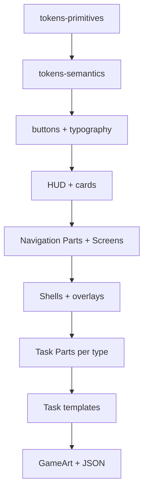

# UI styling guide (Learning Toolkit)

Beginner-oriented guide for **menus, quest shell, tasks, cutscenes, and overlays**. Navigation and quest flow use **UI Toolkit (UITK)** only — no Canvas/uGUI for these screens.

**Related docs**

| Doc | Use when |
|-----|----------|
| [ui-learning-toolkit-inventory.md](../unity/ui-learning-toolkit-inventory.md) | Full file list, task-type matrix, C# class map |
| [02-steps-and-rewards.md](02-steps-and-rewards.md) | `content_json` fields (`sceneBackgroundAsset`, `assetId`, rewards) |
| [AGENTS.md](../../AGENTS.md) | Navigation flow, GameArt rules, shell routing |
| [`.cursor/skills/unity-task-type-ui/SKILL.md`](../../.cursor/skills/unity-task-type-ui/SKILL.md) | Adding or changing a task-type UI |

---

## 1. Mental model: three layers

Think of the UI in three layers. **Most visual changes stay in layers 1 and 2**; layer 3 is for pictures and backgrounds.

```text
┌─────────────────────────────────────────────────────────────┐
│  Layer 3 — Assets (images)                                   │
│  PNG under Resources/UI/GameArt/ + optional HTTP URLs        │
└───────────────────────────┬─────────────────────────────────┘
                            │ referenced from JSON or USS
┌───────────────────────────▼─────────────────────────────────┐
│  Layer 2 — Layout (UXML in UI Builder)                       │
│  Screens, Shells, Templates, Parts — structure + class names │
└───────────────────────────┬─────────────────────────────────┘
                            │ styled by
┌───────────────────────────▼─────────────────────────────────┐
│  Layer 1 — Design system (USS)                               │
│  Colors, spacing, typography, buttons, cards, HUD, tasks   │
└─────────────────────────────────────────────────────────────┘
```

| Layer | Where | What you change | Effect |
|-------|--------|-----------------|--------|
| **USS** | `Assets/Resources/UI/LearningToolkit/*.uss` | Tokens (`--lg-sea-500`), classes (`lg-btn`, `lg-game-panel`) | **Global** — every screen using that class |
| **UXML** | `Screens/`, `Shells/`, `Templates/` | Hierarchy, `class="…"`, `ui:Instance` overrides | **Per layout** — one screen or one task template |
| **Assets** | `Assets/Resources/UI/GameArt/` | PNG sprites; keys in DB `content_json` | **Per chapter/quest/step** when driven by JSON |

**Rule of thumb:** change **tokens or component USS** first for brand colors and typography; use **Parts** for repeating rows/cards; use **per-screen UXML** only for layout that truly differs; use **GameArt + JSON** for story-specific pictures and step backgrounds.

---

## 2. How the theme reaches every screen

At Play Mode, [`LearningToolkitBootstrap`](../../Assets/Scripts/Presentation/LearningToolkitBootstrap.cs) attaches one shared theme to all Learning Toolkit UI:

| Resource | Path | Role |
|----------|------|------|
| Panel settings | `Resources/UI/LearningMenusPanelSettings` | Scale, panel defaults (runtime clone) |
| Theme | `Resources/UI/LearningToolkit/LearningMenusTheme` | Imports Unity default theme + app USS |
| Text settings | `Resources/UI/LearningMenusPanelTextSettings` | Fonts / UITK text defaults |

Layouts load from `Resources/UI/LearningToolkit/{path}` **without** `.uxml`, e.g. `Screens/MainMenuScreen`, `Shells/TaskShellScreen`.

```text
LearningMenusTheme.tss
  └── @import unity-theme://default
  └── @import theme-learn.uss
        └── tokens-primitives.uss      (raw palette, spacing, font sizes)
        └── tokens-semantics.uss       (aliases: --lg-bg-app, --lg-text-main, …)
        └── components-*.uss           (buttons, cards, HUD, overlays, …)
        └── task-templates.uss, cutscene-narrative.uss, special-screen-*.uss
        └── game-art-backgrounds.uss   (preview backgrounds for nav/shell)
```

You normally **do not** add `<Style>` blocks inside each UXML. Classes like `lg-btn lg-btn--primary` pick up rules from the theme automatically.

---

## 3. Layer 1 — USS design system

All app styles use the **`lg-` prefix** (Learning Game). Prefer **CSS custom properties** from tokens instead of hard-coded `rgb(...)` in component files.

### 3.1 Token files (change these first)

| File | Edit when you want to… |
|------|-------------------------|
| [`tokens-primitives.uss`](../../Assets/Resources/UI/LearningToolkit/tokens-primitives.uss) | Change **brand palette**, base spacing, radii, font **sizes** (`--lg-sea-500`, `--lg-space-16`, `--lg-font-body`, …) |
| [`tokens-semantics.uss`](../../Assets/Resources/UI/LearningToolkit/tokens-semantics.uss) | Change **roles**: app background, main text, task surface, HUD, feedback colors (`--lg-bg-app`, `--lg-text-main`, …) |

Example: to shift the whole app toward a cooler blue, edit `--lg-sea-500` / `--lg-sea-600` in **primitives**, then check buttons and links that use semantic aliases.

### 3.2 Component USS (reusable classes)

| File | Styles |
|------|--------|
| [`components-typography.uss`](../../Assets/Resources/UI/LearningToolkit/components-typography.uss) | `lg-heading-display`, `lg-text-body`, shell layout (`lg-shell`, `lg-page-header`, auth centering) |
| [`components-buttons-fields.uss`](../../Assets/Resources/UI/LearningToolkit/components-buttons-fields.uss) | `lg-btn` (+ `--primary`, `--nav`, `--secondary`, `--ghost`), TextField / inputs |
| [`components-cards-lists.uss`](../../Assets/Resources/UI/LearningToolkit/components-cards-lists.uss) | `lg-game-panel`, quest/cut shell layout, leaderboard rows, list chips (`--new`, `--bonus`, `--lock`) |
| [`components-hud.uss`](../../Assets/Resources/UI/LearningToolkit/components-hud.uss) | Wallet strip (`lg-hud-badge`, pizza / backpack) |
| [`components-overlays-empty.uss`](../../Assets/Resources/UI/LearningToolkit/components-overlays-empty.uss) | Loading overlay, modals, banners, `lg-preview-sample` (editor-only marker) |

### 3.3 Domain-specific USS

| File | Styles |
|------|--------|
| [`task-templates.uss`](../../Assets/Resources/UI/LearningToolkit/task-templates.uss) | Shared quest-step chrome (`lg-task-template-root`, prompts, `scene-background-host`, matching columns) |
| [`cutscene-narrative.uss`](../../Assets/Resources/UI/LearningToolkit/cutscene-narrative.uss) | Beat rows, bubbles, avatar slots (`lg-cutscene-beat-row--playerLeft`, …) |
| [`special-screen-messenger.uss`](../../Assets/Resources/UI/LearningToolkit/special-screen-messenger.uss) | SMS / messenger chrome |
| [`special-screen-mail.uss`](../../Assets/Resources/UI/LearningToolkit/special-screen-mail.uss) | Mail editor chrome |
| [`special-screen-photo-viewer.uss`](../../Assets/Resources/UI/LearningToolkit/special-screen-photo-viewer.uss) | Photo viewer |
| [`special-screen-reader.uss`](../../Assets/Resources/UI/LearningToolkit/special-screen-reader.uss) | Reader / magazine layout |
| [`game-art-backgrounds.uss`](../../Assets/Resources/UI/LearningToolkit/game-art-backgrounds.uss) | **UI Builder preview** for nav/shell backgrounds via `resource("UI/GameArt/…")` |

**Adding a new USS file:** create the file, then add `@import url("your-file.uss");` to [`theme-learn.uss`](../../Assets/Resources/UI/LearningToolkit/theme-learn.uss) (order matters: tokens before components that use them).

### 3.4 ScriptableObject tokens (`UiDesignTokens`) — second system

[`UiDesignTokens`](../../Assets/Scripts/Presentation/UiDesignTokens.cs) is a **ScriptableObject** (optional default: `Resources/UI/UiDesignTokens_Default`) read by [`UiThemeProvider`](../../Assets/Scripts/Presentation/UiThemeProvider.cs).

| USS `--lg-*` | `UiDesignTokens` |
|--------------|------------------|
| Primary path for **all** Learning Toolkit menus and quest UI | Used when **C#** needs colors/sizes, or **chapter theme swap** via `ChapterThemeRuntime` + `paletteKey` in chapter `themeJson` |
| Edited in `.uss` files | Edited in Inspector on the asset |

**For styling work:** stay in USS unless you are explicitly wiring chapter palette swap or a C#-built UI. Do not duplicate colors in both places without a reason.

### 3.5 UITK / USS limitations (good to know)

- Prefer **borders** over expecting CSS box-shadow everywhere; some shadow tokens exist for overlays but USS is limited vs web CSS.
- USS has **no `:last-child`** — use explicit modifier classes (e.g. `lg-header-actions-host__btn--trailing`).
- Use **`var(--lg-…)`** in rules so token changes propagate.

---

## 4. Layer 2 — UXML layout (UI Builder)

### 4.1 Folder roles

```text
Assets/Resources/UI/LearningToolkit/
├── Screens/          Full-screen navigation (own Unity scenes)
├── Shells/           Quest scene chrome (Task vs Cutscene)
└── Templates/
    ├── Parts/        Reusable rows, cards, bubbles (single source of truth)
    ├── Tasks/        One full layout per task_type
    ├── Cutscenes/    Beat pager layouts
    ├── SpecialScreens/   Composite “app” chrome (SMS, mail, photo, reader)
    └── Overlays/     Pause, reward, loading, modals
```

| Type | Loaded once? | Runtime rebuild? |
|------|--------------|------------------|
| **Screen** | Yes (`UIDocument` in scene view) | No — bind labels/data in C# |
| **Shell** | Yes (quest scene) | Step content swapped inside `step-host` |
| **Task template** | Mounted into `step-host` | **Yes** — `ClearHost` + `InstantiatePart` from JSON |
| **Part** | Cloned at runtime | Built per row/card from API data |
| **Overlay** | Cloned onto `overlay-plane` | Shown/hidden by overlay classes |

### 4.2 Screens vs shells

| | **Screen** | **Shell** |
|---|------------|-----------|
| **When** | Main menu, chapter map, auth, shop, leaderboard | Inside **Quest** scene only |
| **UXML** | `Screens/*.uxml` | `Shells/TaskShellScreen.uxml` or `CutShellScreen.uxml` |
| **Contains** | Page layout, navigation header parts | Wallet (task only), pause, **Controlla** / **Weiter**, `step-host`, `overlay-plane` |
| **C#** | `*View.cs` (e.g. `MainMenuView`) | `TaskShellPresenter` / `CutsceneShellPresenter` |

Task **content** never duplicates shell buttons — step templates must not add a second “submit” button; the shell owns **Controlla**.

### 4.3 Parts vs templates

| | **Part** | **Task template** |
|---|----------|-------------------|
| **Path** | `Templates/Parts/{Domain}/*.uxml` | `Templates/Tasks/{TaskType}/*TaskTemplate.uxml` |
| **Size** | One row, card, gap field, chat bubble, … | Full step layout (hosts + preview instances) |
| **Reuse** | Shared across tasks **and** UI Builder preview | One per `task_type` |
| **Example** | `McOptionRowPart.uxml` | `MultipleChoiceTaskTemplate.uxml` |

**Single-source rule:** if the same row appears twice (preview + runtime), it lives **only** in a Part. The task template references it; C# calls `ToolkitStepUx.InstantiatePart` with the same path from [`ToolkitStepTemplatePaths`](../../Assets/Scripts/Presentation/ToolkitStepTemplatePaths.cs).

### 4.4 UI Builder: `ui:Template` + `ui:Instance`

In UI Builder, task templates **compose** parts instead of copying markup:

1. Add **`ui:Template`** pointing at the part `.uxml` (GUID from the part’s `.meta` file).
2. Add **`ui:Instance template="PartName"`** inside a named **host** (e.g. `options-host`).
3. Optional: override preview text on the instance (`text="Destra"`).

At runtime, the step’s `Bind()` method:

1. `ToolkitStepUx.ClearHost(host)` — removes preview children.
2. `ToolkitStepUx.InstantiatePart(...)` — clones parts from live `contentJson`.

**Important:** put preview `ui:Instance` nodes **only** under hosts that `ClearHost` clears. Otherwise Play Mode shows duplicate rows.

After moving or renaming parts: **Tools → Learning Toolkit → Validate UXML Template References**.

### 4.5 Navigation chrome parts

Recurring header + wallet live under **`Templates/Parts/Navigation/`**:

| Part | Role |
|------|------|
| `NavigationWalletHudPart.uxml` | Pizza + backpack badges |
| `NavigationPageHeaderWithWalletPart.uxml` | Title + action buttons + wallet + pause |
| `NavigationPageHeaderChapterOverviewPart.uxml` | Chapter overview variant (avatar entry, etc.) |
| `NavigationPageHeaderMinimalPart.uxml` | Header **without** wallet (leaderboard) |

Screens **compose** these via `ui:Template` / `ui:Instance`. Screen-specific buttons (refresh, brochure) sit in `header-actions-host` on the **screen** UXML.

Runtime: wallet numbers via [`WalletHudBinder`](../../Assets/Scripts/Presentation/WalletHudBinder.cs); pause via [`LearningToolkitPauseChromeBinder`](../../Assets/Scripts/Presentation/LearningToolkitPauseChromeBinder.cs). Paths: [`ToolkitNavigationTemplatePaths`](../../Assets/Scripts/Presentation/ToolkitNavigationTemplatePaths.cs).

### 4.6 Overlays

Layouts: `Templates/Overlays/*.uxml`. Runtime: classes under `Assets/Scripts/Presentation/Overlays/` + [`ToolkitOverlayTemplatePaths`](../../Assets/Scripts/Presentation/ToolkitOverlayTemplatePaths.cs).

- Edit copy/layout in UXML (fixture text often uses class `lg-preview-sample`).
- **Do not** rebuild overlay DOM in C#.
- Style shared modal chrome in `components-overlays-empty.uss`.

### 4.7 Scene backgrounds in UXML

Task and cut shells use:

- Root: `lg-scene-bg-root` (+ optional `lg-gameart-bg--*` for UI Builder preview).
- Child **`scene-background-host`** as **sibling of `main-column`** on the shell root (not only inside a narrow stage band).

Per-step backgrounds come from JSON `sceneBackgroundAsset` at runtime ([`ToolkitSceneBackgroundBinder`](../../Assets/Scripts/Presentation/ToolkitSceneBackgroundBinder.cs)). When host-driven art is active, class `lg-scene-bg-root--host-driven` avoids double backgrounds.

---

## 5. Layer 3 — Assets (GameArt)

### 5.1 On disk

```text
Assets/Resources/UI/GameArt/
├── _MasterPlaceholders/     Masters for placeholder script
├── static/
│   ├── navigation/backgrounds/, buttons/
│   ├── hud/                 Pizza / backpack icons
│   ├── task-scene-backgrounds/
│   └── cutscene-backgrounds/
├── portraits/player/, portraits/npc/
└── … chapter-specific folders (e.g. static/chapter-02/…)
```

Unity loads them with prefix **`UI/GameArt/...`** (no `Assets/Resources/` in the key).

### 5.2 Static vs dynamic

| Kind | How it is chosen | Who applies it |
|------|------------------|----------------|
| **Static (navigation)** | Fixed per screen — keys in [`GameArtAssetKeys`](../../Assets/Scripts/Presentation/GameArtAssetKeys.cs) | [`ToolkitNavigationScreenBinder`](../../Assets/Scripts/Presentation/ToolkitNavigationScreenBinder.cs) in view `Awake` |
| **Static (defaults)** | Default task/cutscene BG if JSON omits field | USS `game-art-backgrounds.uss` + binder fallbacks |
| **Dynamic (per step)** | `sceneBackgroundAsset` in `content_json` | `ToolkitSceneBackgroundBinder` on `scene-background-host` |
| **Dynamic (per item)** | `assetId` on options, stems, tiles, … | [`ToolkitStepMediaBinder`](../../Assets/Scripts/Presentation/ToolkitStepMediaBinder.cs) |
| **Portraits (cutscene)** | Player: fixed path; NPC: `npcCast[].portraitId` | `CutsceneAvatarSlotBinder`, `GameArtResourceLoader` |
| **HTTP (legacy)** | `imageUrl` / `audioUrl` in JSON | `UnityWebRequest` after URL validation — prefer **`assetId`** for new content |

Authoring keys are **lowercase path segments after `GameArt/`** (web Zod normalizes mixed case). Defaults: `static/task-scene-backgrounds/ph-st-task-bg-default`, `static/cutscene-backgrounds/ph-st-cutscene-bg-default`.

### 5.3 Placeholder workflow for new art keys

1. Add PNG under `Assets/Resources/UI/GameArt/…` (or run [`scripts/populate-gameart-placeholders.py`](../../scripts/populate-gameart-placeholders.py) from `_MasterPlaceholders`).
2. Reference key in migration / `content_json` (`sceneBackgroundAsset`, `assetId`).
3. Optional: add `resource("UI/GameArt/…")` rule in `game-art-backgrounds.uss` for UI Builder preview.

**Styling vs swapping art:** USS controls **frames, padding, and layout** around images; swapping the **picture** is usually a new PNG + JSON key, not a USS color change.

---

## 6. Central vs decentralized — quick reference

| Change | Central (edit once) | Decentral (edit per file) |
|--------|---------------------|---------------------------|
| Primary button color | `tokens-primitives.uss` / `components-buttons-fields.uss` | Rare: extra class on one screen UXML |
| All body text size | `tokens-primitives.uss` (`--lg-font-body`) | — |
| Multiple-choice option row | `Parts/MultipleChoice/McOptionRowPart.uxml` + shared USS | Task template only for **host layout** |
| Chapter map quest chip | `components-cards-lists.uss` + `ChapterOverviewScreen.uxml` | — |
| One quest’s task background | — | `content_json` → `sceneBackgroundAsset` + PNG in GameArt |
| SMS bubble shape | `special-screen-messenger.uss` + bubble **Parts** | `SpecialScreenMessengerChrome.uxml` layout |
| Leaderboard row height | `LeaderboardPlayerRowPart.uxml` + `components-cards-lists.uss` | `LeaderboardScreen.uxml` list host only |

---

## 7. Complete UI inventory (what you can style)

Paths are under `Assets/Resources/UI/LearningToolkit/`. **79** UXML files total. Deeper tables: [ui-learning-toolkit-inventory.md](../unity/ui-learning-toolkit-inventory.md).

### 7.1 Navigation screens (7 + 1 preview)

| UXML | Scene | View | Wallet HUD |
|------|-------|------|--------------|
| `Screens/AuthScreen.uxml` | Auth | `AuthView` | — |
| `Screens/MainMenuScreen.uxml` | MainMenu | `MainMenuView` | optional (labels may be hidden) |
| `Screens/LeaderboardScreen.uxml` | Leaderboard | `LeaderboardView` | no (minimal header) |
| `Screens/ChapterOverviewScreen.uxml` | ChapterOverview | `ChapterOverviewView` | yes |
| `Screens/QuestOverviewScreen.uxml` | QuestOverview | `QuestOverviewView` | yes |
| `Screens/AvatarShopScreen.uxml` | AvatarShop | `AvatarShopView` | yes |
| `Screens/ToolkitPreviewScreen.uxml` | Editor only | — | button swatch preview |

### 7.2 Quest shells (2)

| UXML | When | Notable chrome |
|------|------|----------------|
| `Shells/TaskShellScreen.uxml` | `task`, quest finish | Wallet, reference doc button, `lg-game-panel`, **Controlla**, reward overlay |
| `Shells/CutShellScreen.uxml` | `cutscene` | Pause, full-bleed background, **Weiter** — **no** wallet / task panel |

### 7.3 Overlays (8)

`ConfirmModal`, `InfoBanner`, `LoadErrorBanner`, `LoadingOverlay`, `PauseMenuModal`, `ReferenceDocumentModal`, `RewardModal`, `UnlockModal`

### 7.4 Task templates (6 implemented types)

| Folder | `task_type` |
|--------|-------------|
| `Templates/Tasks/ClozeText/` | ClozeText |
| `Templates/Tasks/DragDrop/` | DragDrop |
| `Templates/Tasks/MultipleChoice/` | MultipleChoice |
| `Templates/Tasks/Matching/` | Matching |
| `Templates/Tasks/ErrorSpotting/` | ErrorSpotting |
| `Templates/Tasks/FreitextLlm/` | FreitextLlm |

**Special Screen family** (composite): `Templates/SpecialScreens/SpecialScreenHost.uxml` + chrome (`Messenger`, `Mail`, `Photo`, `Reader`) — many `task_type` aliases, one implementation.

**Stub** (placeholder UI): `Templates/Parts/Common/StubTaskPanelPart.uxml` for unimplemented types.

### 7.5 Cutscene templates (5)

`CutsceneHost`, `CutsceneNarratorBeat`, `CutsceneNpcDialogBeat`, `CutsceneInnerMonologueBeat`, `CutsceneGameInfoBeat`

### 7.6 Parts by domain (49 files)

| Domain | Count | Examples |
|--------|-------|----------|
| `Navigation/` | 4 | Wallet, headers |
| `Leaderboard/` | 3 | Player row, team summary, section header |
| `MultipleChoice/` | 4 | Option row, stem text/image/audio |
| `ClozeText/` | 3 | Line row, literal, gap field (see **Cloze row layout** below) |
| `DragDrop/` | 8 | Tile, drop zone, line row, bank wrap, … |
| `Matching/` | 3 | Card, column header, left row |
| `ErrorSpotting/` | 5 | Slot, chip, inline field; `ErrorSpottingSlotMarkedPart` = **preview only** |
| `SpecialScreen/` | 18 | Chat rows, bubbles, photo grid, reader lines, … |
| `Common/` | 1 | Stub task panel |

### Cloze row layout (`task-templates.uss`)

Sentence-style cloze (one `lines[]` row = one horizontal sentence):

| Rule | USS / structure |
|------|------------------|
| Keep literals + gaps on one logical line | `.lg-cloze-line-row`: `flex-wrap: nowrap`, `align-items: center` |
| Narrow viewports | `overflow-x: auto` on the row (horizontal scroll beats wrapping every gap to its own line) |
| Not the same as Error Spotting | Error rows may use `flex-wrap: wrap`; cloze rows should **not** copy that |
| Inline gaps | `lg-cloze-gap-inline` with `margin-bottom: 0` (override `lg-textfield` form spacing) |
| Tall tasks | `#cloze-lines-host` / `.lg-cloze-lines-host`: `flex-grow: 1`, `min-height: 0` inside task template |
| Authoring | Prefer **multiple `lines[]` entries** over `\n` inside a single text segment when dialogue has many gaps |

---

## 8. Recommended styling order (for beginners)

Work **top-down** so early changes propagate and you do not repaint the same button in twelve files.

### Phase A — Global design system (1–2 sessions)

1. **`tokens-primitives.uss`** — palette, spacing, radii, font sizes.
2. **`tokens-semantics.uss`** — app background, text, task surfaces, feedback.
3. **`components-buttons-fields.uss`** — primary / nav / secondary buttons, inputs.
4. **`components-typography.uss`** — headings and body classes.
5. **Play Mode smoke test** on `Screens/ToolkitPreviewScreen.uxml` or `MainMenuScreen` + one task.

### Phase B — Shared chrome (1 session)

6. **`components-hud.uss`** + `NavigationWalletHudPart.uxml`.
7. **`components-cards-lists.uss`** — panels, list rows, quest chips.
8. **Navigation parts** (`NavigationPageHeader*`) then **screens** that compose them:
   - Auth → Main menu → Chapter overview → Quest overview → Leaderboard → Avatar shop.

### Phase C — Quest shell (1 session)

9. **`Shells/TaskShellScreen.uxml`** + `task-templates.uss` + `game-art-backgrounds.uss` (preview).
10. **`Shells/CutShellScreen.uxml`** + `cutscene-narrative.uss`.
11. **`components-overlays-empty.uss`** + overlay UXML (pause, reward, loading).

### Phase D — Task types (repeat per type)

For each task type, in order:

12. **Parts** in `Templates/Parts/{Domain}/` (row/card looks).
13. **Task template** `Templates/Tasks/{Type}/*TaskTemplate.uxml` (hosts, spacing only).
14. **`task-templates.uss`** only if the change is shared across **all** task types.

Suggested task order (simple → complex):

1. MultipleChoice  
2. ClozeText  
3. Matching  
4. DragDrop  
5. ErrorSpotting  
6. FreitextLlm  
7. Special Screen family (`special-screen-*.uss` + parts + chrome UXML)  
8. Cutscene beats last if narrative spacing depends on final task panel height.

### Phase E — Content-driven art (ongoing)

15. Replace **GameArt** PNGs and keys in Supabase `content_json` — not USS — for story-specific backgrounds and illustrations.
16. Run placeholder script when adding new keys before final art exists.



---

## 9. Practical workflows

### Change the primary brand color everywhere

1. Edit `--lg-sea-500` / `--lg-sea-600` in `tokens-primitives.uss`.
2. Check semantic aliases in `tokens-semantics.uss` if buttons use those.
3. Play Mode: main menu + one task with `lg-btn--primary`.

### Restyle multiple-choice options

1. `Templates/Parts/MultipleChoice/McOptionRowPart.uxml` — structure / classes.
2. Shared rules in `task-templates.uss` or `components-cards-lists.uss` if all tasks share the same row chrome.
3. Do **not** duplicate row markup inside `MultipleChoiceTaskTemplate.uxml`.

### New navigation screen background

1. PNG → `Assets/Resources/UI/GameArt/static/navigation/backgrounds/…`
2. Key in `GameArtAssetKeys` + `game-art-backgrounds.uss` (`lg-gameart-bg--*`)
3. `ToolkitNavigationScreenBinder.Apply*Screen` in the view’s `Awake`
4. Root classes on screen UXML: `lg-scene-bg-root`, `scene-background-host` sibling of `main-column`

### Per-quest task scene background

1. Author `sceneBackgroundAsset` in step `content_json` (see [02-steps-and-rewards.md](02-steps-and-rewards.md)).
2. PNG at `GameArt/{key}`.
3. Verify in Play Mode — binder sets `scene-background-host` at runtime (overrides USS preview on shell).

### Fix “double rows” in Play Mode

- Preview `ui:Instance` was placed outside a `ClearHost` target, or nested part inner host was not cleared before `InstantiatePart`. See skill checklist in [unity-task-type-ui/SKILL.md](../../.cursor/skills/unity-task-type-ui/SKILL.md).

---

## 10. What to avoid

| Do not | Do instead |
|--------|------------|
| Hard-code colors in C# for Toolkit UI | USS classes or `var(--lg-…)` |
| Copy part markup into task templates | `ui:Template` + `InstantiatePart` |
| Add Canvas/uGUI for menu/quest flow | UI Toolkit only |
| Put `scene-background-host` only inside a small cutscene stage | Sibling of `main-column` on shell root |
| Style each option row in six task C# files | One Part + one USS rule |
| Rebuild overlay UI in code | Edit `Templates/Overlays/*.uxml` |
| Commit secrets or API keys in USS/UXML | Server-side only |

---

## 11. Implementation touchpoints (when styling is not enough)

| Goal | Also touch |
|------|------------|
| New `task_type` UI | `*ToolkitStep.cs`, `ToolkitStepFactory`, Zod schema, `ToolkitStepTemplatePaths` |
| New `sceneBackgroundAsset` / `assetId` field | Web `stepContentValidation.ts`, migration JSON, `GameArtAssetKeys` |
| New overlay | `Templates/Overlays/`, `ToolkitOverlayTemplatePaths`, `LearningToolkit*Overlay*.cs` |
| Chapter palette swap | `UiDesignTokens` asset + `ChapterThemeRuntime` (does **not** replace `LearningMenusTheme.tss`) |

---

## 12. Tools and verification

| Tool | Purpose |
|------|---------|
| **UI Builder** | Edit UXML/USS visually; open from Project window |
| **Tools → Learning Toolkit → Validate UXML Template References** | GUID / `ui:Instance` integrity after moving parts |
| **Play Mode** | Always verify on real scenes (`Auth`, `ChapterOverview`, `Quest`) |
| `npm run test:chapter01-migration` (in `apps/web`) | Payload keys in migrations match GameArt conventions (when authoring content) |

---

## 13. Screen → USS cheat sheet

| UI area | Start in USS | Layout UXML |
|---------|--------------|-------------|
| Auth / forms | `components-typography`, `components-buttons-fields` | `Screens/AuthScreen.uxml` |
| Main menu actions | `components-buttons-fields` | `Screens/MainMenuScreen.uxml` |
| Chapter / quest lists | `components-cards-lists` | `ChapterOverviewScreen`, `QuestOverviewScreen` |
| Wallet | `components-hud` | `NavigationWalletHudPart.uxml` |
| Task shell frame | `task-templates`, `components-cards-lists` | `Shells/TaskShellScreen.uxml` |
| Cutscene narrative | `cutscene-narrative` | `Templates/Cutscenes/*Beat.uxml` |
| Modals | `components-overlays-empty` | `Templates/Overlays/*.uxml` |
| MC / Cloze / … rows | `task-templates` + domain Part | `Templates/Parts/{Domain}/*` |

When in doubt: **tokens → components → parts → screen/shell UXML → GameArt**.
