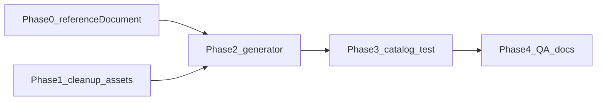

# Chapter 02 — detailed implementation plan

**Deliverable file (after you approve this plan):** create [`docs/chapter-02-detailed-implementation-plan.md`](docs/chapter-02-detailed-implementation-plan.md) with this content for the team to track execution.

**Sources:** [`docs/chapter-02-implementation-overview.md`](docs/chapter-02-implementation-overview.md), [`docs/content_raw/chapter-2.md`](docs/content_raw/chapter-2.md), pattern from [`scripts/generate-chapter-01-catalog.mjs`](scripts/generate-chapter-01-catalog.mjs).

**Branch:** `web-based-implementation`.

**Simplification principles**

- **One code path** for documento images: `referenceDocument.figures[]` (length 1 for freetext, length 6 for quiz); no separate top-level `image` field.
- **One generator script** writes the full catalog (like chapter 01), then `node scripts/generate-chapter-02-catalog.mjs` — avoid hand-editing 56 JSON files.
- **Quiz:** always **2** `questions[]` per scene; Schritt A uses **combined** option labels when a sentence has multiple blanks (confirmed).
- **Steckbrief:** union `correctAnswers` per gap (option A); no branching.
- **StoryPanel** already uses `whitespace-pre-line` ([`components/game/shell/StoryPanel.tsx`](components/game/shell/StoryPanel.tsx)) — no extra UI task.

---

## Target catalog shape

| Quest | Scenes | Tasks |
|-------|--------|-------|
| `quest-01` | 3 | 0 |
| `quest-02` | 15 | 1 cloze + 4 freetext |
| `quest-03` | 13 | 1 cloze + 6 MC |
| `quest-04` | 21 | 1 drag_drop + 5 freetext |
| `quest-01-bonus` | 4 | 1 matching pool |
| **Total** | **56** | **19** |

[`chapter.json`](lib/content/chapters/chapter-02/chapter.json): `title` «Bologna — secondo giorno», `order: 2`, `locked: false`, five quest ids in order.

**Quest hub titles (Italian, for `quest.json`):**

| Quest | `title` |
|-------|---------|
| quest-01 | La mattina a casa |
| quest-02 | La Nutelleria |
| quest-03 | Il progetto di scuola |
| quest-04 | La Trattoria da Marini |
| quest-01-bonus | Extra: parole della lezione |

---

## Phase dependency



---

## Phase 0 — `referenceDocument` platform (blocker for chapter 02 JSON)

**Goal:** Documento shows optional intro text, profile **sections**, and **figure** grids (image + caption). Backward compatible: existing `title` + `body`/`bodyText` only still works.

### 0.1 Schema

**File:** [`lib/game/schemas/referenceDocumentSchema.ts`](lib/game/schemas/referenceDocumentSchema.ts)

Add optional:

```ts
figures: z.array(z.object({
  image: z.string().min(1),      // asset key, same as scene background
  caption: z.string().min(1),
  alt: z.string().optional(),
})).optional(),
sections: z.array(z.object({
  title: z.string().min(1),
  body: z.string().min(1),       // accept bodyText alias in normalizer
})).optional(),
```

**Refine:** `title` required; at least one of: non-empty `bodyText`/`body`, `sections?.length`, `figures?.length`.

**Files to touch:** [`lib/game/schemas/referenceDocumentSchema.test.ts`](lib/game/schemas/referenceDocumentSchema.test.ts) — add cases: legacy text-only, single figure, gallery ×6, sections ×3.

### 0.2 Normalize / catalog

**File:** [`lib/game/tasks/freitext/merge-freitext-scene-content.ts`](lib/game/tasks/freitext/merge-freitext-scene-content.ts) — `normalizeReferenceDocumentForTask` passes through `figures` / `sections`; keep `body` → `bodyText` merge.

Confirm scene-level `content.referenceDocument` in catalog load still validates (loader already touches reference docs in [`lib/game/content/catalog-loader.ts`](lib/game/content/catalog-loader.ts)).

### 0.3 Play + overlay UI

**Files:**

- [`app/(game)/play/page.tsx`](app/(game)/play/page.tsx) — extend `readReference()` to return `{ title, body?, sections?, figures? }` (not only `body` string).
- [`components/game/overlays/ReferenceDocumentOverlay.tsx`](components/game/overlays/ReferenceDocumentOverlay.tsx):
  - Optional intro `body` (`whitespace-pre-wrap`).
  - `sections`: heading + paragraph per block (Steckbrief).
  - `figures`: responsive **2-column grid** (`md:grid-cols-2`), one column on small screens; each card: image via [`resolveAssetUrl`](lib/game/content/resolve-asset-url.ts), `object-cover`, aspect `4/3`, `max-h-32`/`max-h-36`, caption under image (`text-sm`, centered).
  - Missing PNG: still show caption (optional muted “immagine non disponibile” — only if trivial).

No MC option images; quiz step B stays **name-only** labels.

### 0.4 Docs (platform slice)

Update [`docs/quest-scene-content-format.md`](docs/quest-scene-content-format.md) § `referenceDocument` with `figures` / `sections` examples (replace “plain text only” note).

---

## Phase 1 — Cleanup and asset placeholders

1. **Delete** entire [`lib/content/chapters/chapter-02/`](lib/content/chapters/chapter-02/) stub tree (do not patch).
2. Create **`.gitkeep`** tree under `public/content-assets/chapters/02/` mirroring chapter 01:
   - `chapter/`, `quests/01`…`04`, `quests/bonus/`
3. Document asset key list in generator header comment (no PNGs required for `loadContentCatalog` / CI).

**Asset keys (authoring)**

| Use | Key pattern |
|-----|-------------|
| Chapter hub | `chapters/02/chapter/bg-missions` |
| Quest overview | `chapters/02/quests/{01-04|bonus}/bg-overview` |
| Scene BGs | `chapters/02/quests/NN/bg-nutelleria`, `bg-desk`, `bg-trattoria`, `bg-room-morning`, … |
| Quiz faces ×6 | `chapters/02/quests/03/ref-quiz-{verdi,colombo,montessori,michelangelo,ferrante,da-vinci}` |
| Freetext ×9 | `chapters/02/quests/02/ref-prof-*`, `chapters/02/quests/04/ref-menu-*` |

---

## Phase 2 — Generator script (full chapter JSON)

**File:** `scripts/generate-chapter-02-catalog.mjs` (copy structure from chapter 01: `writeJson`, `story()`, scoring helpers).

**Run once after edits:** `node scripts/generate-chapter-02-catalog.mjs`

### 2.1 Shared helpers in script

- `story(chapterId, questId, n, bg, text)` — ids `chapter-02-{quest}-scene-{NN}`.
- `scoredPizza` / `flatPizza` — values from [overview draft scoring](docs/chapter-02-implementation-overview.md#draft-scoring-placeholder-for-json).
- `quizPersonGallery()` — constant `referenceDocument` with `documentId: "ch02-quiz-persons"`, `figures` ×6 (names from raw).
- `profileSections()` — Saviano / Del Piero / Ferragni bodies from [`docs/content_raw/chapter-2.md`](docs/content_raw/chapter-2.md).
- `bonusPoolPairs()` — flatten all Lezione 2 vocab tables from raw into `{ leftLabel, rightLabel }[]` for matching.

### 2.2 New Italian (not in raw) — short constants in script

| Scene | Purpose |
|-------|---------|
| quest-01 `03` | Three missions today (no map UI) |
| quest-02 `15` | Exit Nutelleria; two places left |
| quest-03 `13` | Homework saved; restaurant remains |

Keep to 1–3 sentences each; Italian B1.

### 2.3 Quest `quest-01` (3 story)

Verbatim morning beats from raw Akt 2.0 (scenes 01–02); scene 03 = new transition copy.

### 2.4 Quest `quest-02` (15 scenes)

| Scenes | Content |
|--------|---------|
| 01–06 | Story: Nutelleria + Dario dialogue (verbatim, `\n` for NPC/Tu) |
| 07 | **cloze** — Dario dialogue from raw Esercizio 1; literals for `*Benissimo/Buonissimo*` etc.; gaps with `correctAnswers` from raw solutions line |
| 08 | Story: Dario professions intro |
| 09–12 | **free_text** ×4 — architetto, giornalista, medico, giardiniere/a; each: `figures[1]`, shared LLM `evaluation` (che/cui/dove, B1) |
| 13–15 | Story: goodbye, monologue, narrator outro (no map) |

### 2.5 Quest `quest-03` (13 scenes)

| Scenes | Content |
|--------|---------|
| 01–03 | Story + spielinfo (read profiles in documento) |
| 04 | **cloze** Steckbrief — 6 gaps (`nome`, età/DOB, regione, professione, perché famoso, particolarità); union `correctAnswers` from raw reference solutions; `referenceDocument.sections` ×3 |
| 05 | Story: quiz starts |
| 06–11 | **MC** ×6 — each: `referenceDocument` = `quizPersonGallery()`; `questions[0]` grammar (combined labels + distractors from raw solutions); `questions[1]` person (6 name options, one correct per table) |
| 12–13 | Story: hunger + saved compiti |

**Quiz grammar options (example scene 06):** correct `"che · ha fondato"`; distractors plausible wrong pairs; person question correct `montessori`.

### 2.6 Quest `quest-04` (21 scenes)

| Scenes | Content |
|--------|---------|
| 01–10 | Story through spielinfo drag hint |
| 11 | **drag_drop** — letter skeleton + formula bank from raw S. 51; 7 targets; multiple `correctItemIds` where raw allows |
| 12–13 | Story email + menu challenge |
| 14–18 | **free_text** ×5 menù categories; `figures[1]` each; LLM rubric like quest-02 |
| 19–21 | Story: job offer, Tu, narrator sunset |

### 2.7 Bonus `quest-01-bonus` (4 scenes)

| Scenes | Content |
|--------|---------|
| 01–03 | Story recap + spielinfo |
| 04 | **matching** `poolPairs` from `bonusPoolPairs()`, `sampleSize: 10`, `shuffleRightOrder: true`; `kind: "bonus"`, `requiresQuestId: "quest-04"` |

---

## Phase 3 — Catalog test and validation

**File:** `lib/game/content/chapter-02-catalog.test.ts` (mirror [`lib/game/content/chapter-01-catalog.test.ts`](lib/game/content/chapter-01-catalog.test.ts))

Assert:

- Chapter id, title, `locked: false`, `order: 2`
- Quest ids order and `requiresQuestId` chain
- Scene counts: `{ quest-01: 3, quest-02: 15, quest-03: 13, quest-04: 21, quest-01-bonus: 4 }`
- Bonus `sampleSize: 10`, pool size >> 10
- At least one scene with `referenceDocument.figures` length 6 (quiz)
- Steckbrief scene has `sections` length 3

Run: `npm test` (include new + existing referenceDocument tests).

---

## Phase 4 — QA and doc sync

1. `npm run lint`
2. `npm run build`
3. Fix broken anchor in overview (freetext link → reference document section) if still present.
4. Optional: one-line pointer in [`docs/chapter-02-implementation-plan.md`](docs/chapter-02-implementation-plan.md) → detailed plan file.
5. **Manual smoke (local):** login → complete chapter 01 or use test account → chapter 02 unlocked → play quest-01 → open documento on quiz/freetext/steckbrief scenes → MC Avanti/Controlla on quiz scene 06.

**Out of scope (keep simple):** MC images on options; `documentId` server behavior; quest-level referenceDocument; auto-start; parallel quests.

---

## Execution order checklist (copy for PR / tracking)

Use these as PR slices if helpful: **PR1 = Phase 0**, **PR2 = Phases 1–2 + generator run**, **PR3 = Phase 3–4**.
