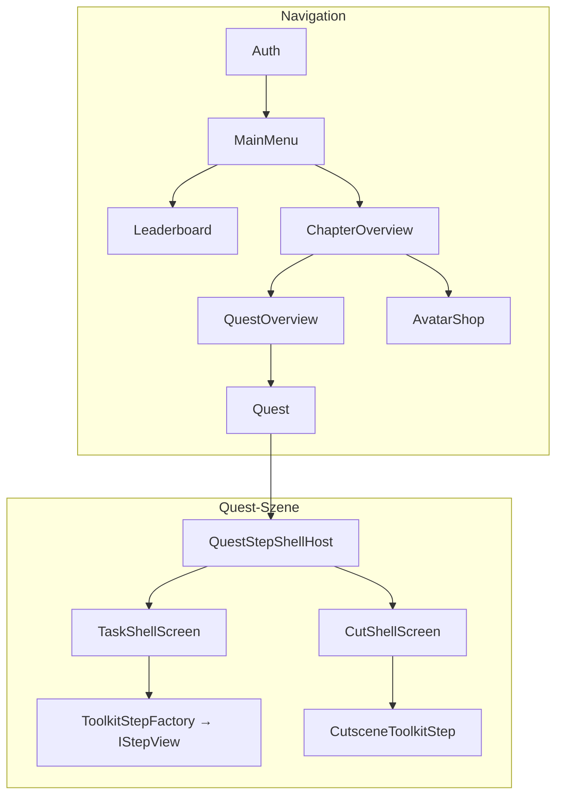

# Learning Toolkit — UI-Inventar

Stand: Inventur des Unity **UI Toolkit**-Baums unter `Assets/Resources/UI/LearningToolkit/` plus zugehörige C#-Schicht (`Assets/Scripts/Presentation/`).  
Zweck: Überblick über **Screens**, **Shells**, **Task-Typen**, **UXML-Templates**, **Parts**, **Cutscenes**, **Overlays** und **Styling** — thematisch gruppiert.

Hinweis: Optionale Maintainer-Dokumentation (nicht build-relevant) — bei Bedarf **separat** von Feature-Commits versionieren.

---

## 0. Ordnerstruktur (`LearningToolkit/`)

```text
LearningToolkit/
├── Screens/                    # Navigation (eigene Szenen)
│   ├── AuthScreen.uxml
│   ├── MainMenuScreen.uxml
│   ├── LeaderboardScreen.uxml
│   ├── ChapterOverviewScreen.uxml
│   ├── QuestOverviewScreen.uxml
│   ├── AvatarShopScreen.uxml
│   └── ToolkitPreviewScreen.uxml
├── Shells/                     # Quest-Szene (Task vs. Cutscene)
│   ├── TaskShellScreen.uxml
│   └── CutShellScreen.uxml
├── Templates/
│   ├── Parts/                  # Wiederverwendbare Zeilen/Karten — nach Domäne
│   │   ├── Navigation/
│   │   ├── Leaderboard/
│   │   ├── ClozeText/
│   │   ├── MultipleChoice/
│   │   ├── DragDrop/
│   │   ├── Matching/
│   │   ├── ErrorSpotting/
│   │   ├── SpecialScreen/
│   │   └── Common/             # StubTaskPanelPart
│   ├── Tasks/                  # Vollbild-Task-Layout — ein Ordner pro task_type
│   │   ├── ClozeText/
│   │   ├── DragDrop/
│   │   ├── MultipleChoice/
│   │   ├── Matching/
│   │   ├── ErrorSpotting/
│   │   └── FreitextLlm/
│   ├── Cutscenes/              # Beat-Pager + presentationMode-Layouts
│   ├── SpecialScreens/         # Chrome + SpecialScreenHost.uxml
│   └── Overlays/               # Pause, Reward, Loading, …
├── *.uss, LearningMenusTheme.tss
└── (CutscenePortraits liegen unter Resources/UI/CutscenePortraits/)
```

**Resources-Pfade:** `SpawnUiDocument(owner, "Screens/MainMenuScreen")` bzw. `ToolkitStepTemplatePaths` → `UI/LearningToolkit/Templates/Parts/{Domäne}/{PartName}` (ohne `.uxml`).

---

## 1. Architektur auf einen Blick



| Ebene | Rolle | Pfad / Klasse |
|-------|--------|----------------|
| **Screen** | Vollbild-Navigation (eigene Szene) | `Screens/*.uxml` |
| **Shell** | Quest-Chrome (HUD, Controlla/Weiter, Overlays) | `Shells/TaskShellScreen.uxml`, `Shells/CutShellScreen.uxml` |
| **Step** | Inhalt in `step-host` | `Templates/Tasks/{Typ}/`, `Templates/Cutscenes/`, Special-Screen-Stack |
| **Part** | Wiederverwendbare Zeile/Karte/Slot | `Templates/Parts/{Domäne}/*.uxml` |
| **Overlay** | Modal/Banner über Shell/Screen | `Templates/Overlays/*.uxml` |

**Laden:** `LearningToolkitBootstrap.SpawnUiDocument(owner, "LayoutName")` → `Resources/UI/LearningToolkit/{LayoutName}.uxml`.  
**Steps:** `ToolkitStepUx.TryMount` / `InstantiatePart` mit Pfaden aus `ToolkitStepTemplatePaths` (ohne `.uxml`).

---

## 2. Szenen und Navigation-Screens

| Szene | Screen-UXML | View (C#) | Wallet-HUD |
|-------|-------------|-----------|------------|
| `Auth` | `Screens/AuthScreen.uxml` | `AuthView` | — |
| `MainMenu` | `Screens/MainMenuScreen.uxml` | `MainMenuView` | optional ohne Labels |
| `Leaderboard` | `Screens/LeaderboardScreen.uxml` | `LeaderboardView` | nein (Minimal-Header) |
| `ChapterOverview` | `Screens/ChapterOverviewScreen.uxml` | `ChapterOverviewView` | ja (`NavigationPageHeaderWithWalletPart`) |
| `QuestOverview` | `Screens/QuestOverviewScreen.uxml` | `QuestOverviewView` | ja |
| `AvatarShop` | `Screens/AvatarShopScreen.uxml` | `AvatarShopView` | ja |
| `Quest` | `Shells/TaskShellScreen` **oder** `Shells/CutShellScreen` | `TaskShellPresenter` / `CutsceneShellPresenter` via `QuestStepShellHost` | ja (nur Task-Shell) |

Weitere Szenen: `Boot`, `SampleScene` (nicht Teil des Spieler-Flows in `AGENTS.md`).

**Editor / Preview:** `Screens/ToolkitPreviewScreen.uxml` (Button-Theme-Swatch, kein Spieler-Screen).

---

## 3. Quest-Shells (ein `Quest`-Szene, zwei Modi)

| Shell | UXML | Presenter | Sichtbar bei `step_kind` |
|-------|------|-----------|---------------------------|
| Task | `Shells/TaskShellScreen.uxml` | `TaskShellPresenter` | `task`, Quest-Ende, kein Step |
| Cutscene | `Shells/CutShellScreen.uxml` | `CutsceneShellPresenter` | `cutscene` |

**Task-Shell:** Quest-Titel, Wallet, optional Referenzdokument, Task-Panel (`lg-game-panel`), **Controlla**, Reward-Overlay.  
**Cut-Shell:** Pause oben, `step-host`, **Weiter** — kein Wallet, kein Brochure-Button, kein Task-Panel.

Gemeinsam: `QuestShellSharedRuntime`, Overlays an `overlay-plane`.

---

## 4. Step-Arten (`game_quest_steps`)

| `step_kind` | Unity-Step | Template-Wurzel |
|-------------|------------|-------------------|
| `cutscene` | `CutsceneToolkitStep` | `Templates/Cutscenes/` |
| `task` | `ToolkitStepFactory` → `*ToolkitStep` | `Templates/Tasks/` (+ Special-Screen-Stack) |

---

## 5. Task-Typen (`task_type`) — nach Implementierungsstatus

Quelle Factory: `ToolkitStepFactory.cs`. Server-Scoring: `apps/web/lib/game/scoring/evaluateTaskAttempt.ts`.

### 5.1 Voll implementiert (UX + Factory + Task-Template)

| `task_type` | C#-Step | Task-Template | Server `evaluateTaskAttempt` |
|-------------|---------|---------------|------------------------------|
| `ClozeText` | `ClozeTextToolkitStep` | `Tasks/ClozeText/ClozeTextTaskTemplate.uxml` | ja |
| `DragDrop` | `DragDropToolkitStep` | `Tasks/DragDrop/DragDropTaskTemplate.uxml` | ja |
| `MultipleChoice` | `MultipleChoiceToolkitStep` | `Tasks/MultipleChoice/MultipleChoiceTaskTemplate.uxml` | ja |
| `Matching` | `MatchingToolkitStep` | `Tasks/Matching/MatchingTaskTemplate.uxml` | ja |
| `ErrorSpotting` | `ErrorSpottingToolkitStep` | `Tasks/ErrorSpotting/ErrorSpottingTaskTemplate.uxml` | ja |
| `FreitextLlm` | `FreitextLlmToolkitStep` | `Tasks/FreitextLlm/FreitextLlmTaskTemplate.uxml` | eigener Evaluate-Flow (`/evaluate` + Gate) |

### 5.2 Special Screen (ein Step, mehrere `task_type`-Aliasse)

| `task_type` | Chrome (UXML) | C# |
|-------------|---------------|-----|
| `SpecialScreen` | abhängig von Payload / Variant | `SpecialScreenToolkitStep` |
| `SpecialScreenSms` | `SpecialScreenMessengerChrome.uxml` | ↑ |
| `SpecialScreenMailEditor` | `SpecialScreenMailChrome.uxml` | ↑ |
| `SpecialScreenPhotoViewer` | `SpecialScreenPhotoChrome.uxml` | ↑ |
| `SpecialScreenReader` | `SpecialScreenReaderChrome.uxml` | ↑ |

Host-Layout: `Templates/SpecialScreens/SpecialScreenHost.uxml`.

**Eingebettete Blöcke** (`blocks[].blockType` in `content_json`):

| `blockType` (Alias) | Verhalten | Server-Scoring in Special Screen |
|---------------------|-----------|----------------------------------|
| `stub` | Platzhalter / Narration | kein Pizza-Anteil |
| `cloze_text` / `ClozeText` | nested Cloze | ja (wie ClozeText) |
| `error_spotting` / `ErrorSpotting` | nested Error Spotting | ja (wie ErrorSpotting) |

Demo-SQL: `supabase/scripts/special_screen_*.sql`.

### 5.3 Stub (Factory kennt Typ, keine echte UI)

| `task_type` | C# | Part |
|-------------|-----|------|
| `FreeText` | `StubToolkitTaskStep` | `StubTaskPanelPart.uxml` |
| `RelativeClause` | `StubToolkitTaskStep` | ↑ |
| *beliebig unbekannt* | `StubToolkitTaskStep` | ↑ |

### 5.4 In DB-Seeds, aber ohne dedizierte Unity-UI

Diese können in `game_quest_steps` vorkommen; Factory fällt auf Stub zurück, sofern nicht unter 5.1/5.2:

- Aus Greenfield-Seed: u. a. Kombinationen in `quest-01` … `quest-04` (siehe Migration `20260518140000_chapter_quest_steps_greenfield.sql`).

---

## 6. UXML-Template-Katalog

Basis: `Assets/Resources/UI/LearningToolkit/Templates/`

### 6.1 Task-Templates (`Templates/Tasks/{taskType}/`)

| Datei | Task-Typ |
|-------|----------|
| `ClozeText/ClozeTextTaskTemplate.uxml` | ClozeText |
| `DragDrop/DragDropTaskTemplate.uxml` | DragDrop |
| `ErrorSpotting/ErrorSpottingTaskTemplate.uxml` | ErrorSpotting |
| `FreitextLlm/FreitextLlmTaskTemplate.uxml` | FreitextLlm |
| `Matching/MatchingTaskTemplate.uxml` | Matching |
| `MultipleChoice/MultipleChoiceTaskTemplate.uxml` | MultipleChoice |

**Konvention:** UI-Builder-Preview via `ui:Template` + `ui:Instance` auf Parts; Runtime: `ClearHost` + `InstantiatePart`.

### 6.2 Cutscene-Templates (`Templates/Cutscenes/`)

| Datei | `presentationMode` (API) |
|-------|----------------------------|
| `CutsceneHost.uxml` | Container für Beat-Pager |
| `CutsceneNarratorBeat.uxml` | `narrator` |
| `CutsceneNpcDialogBeat.uxml` | `npcDialog` |
| `CutsceneInnerMonologueBeat.uxml` | `innerMonologue` |
| `CutsceneGameInfoBeat.uxml` | `gameInfo` |

Schema: `apps/web/lib/game/schemas/cutsceneContentSchema.ts` (`beats[]`, optional `npcCast[]`, `navigation`).

Portraits: `Resources/UI/CutscenePortraits/Player/current`, `.../Npc/{portraitId}`.

### 6.3 Special-Screen-Chrome (`Templates/SpecialScreens/`)

| Datei | Typischer `task_type` |
|-------|------------------------|
| `SpecialScreenHost.uxml` | Host für alle `SpecialScreen*` |
| `SpecialScreenMessengerChrome.uxml` | `SpecialScreenSms` |
| `SpecialScreenMailChrome.uxml` | `SpecialScreenMailEditor` |
| `SpecialScreenPhotoChrome.uxml` | `SpecialScreenPhotoViewer` |
| `SpecialScreenReaderChrome.uxml` | `SpecialScreenReader` |

### 6.4 Overlays (`Templates/Overlays/`)

| UXML | C#-Binder | Verwendung |
|------|-----------|------------|
| `LoadingOverlay.uxml` | `LearningToolkitLoadingOverlay` | Busy / Laden |
| `LoadErrorBanner.uxml` | `LearningToolkitLoadErrorBanner` | Fehlerbanner |
| `InfoBanner.uxml` | `LearningToolkitInfoBanner` | Hinweise |
| `ConfirmModal.uxml` | `LearningToolkitConfirmModal` | Bestätigung |
| `UnlockModal.uxml` | `LearningToolkitUnlockModal` | Freischaltungen |
| `RewardModal.uxml` | `LearningToolkitRewardModal` | Pizza/Belohnung nach Task |
| `ReferenceDocumentModal.uxml` | `LearningToolkitReferenceDocumentModal` | Quest-Broschüre (Task-Shell) |
| `PauseMenuModal.uxml` | `LearningToolkitPauseMenuModal` | Pause |

Pfade: `ToolkitOverlayTemplatePaths.cs`.

### 6.5 Parts (`Templates/Parts/{Domäne}/`) — nach Thema

#### `Navigation/` & `Leaderboard/`

| Part | Verwendung |
|------|------------|
| `Navigation/NavigationWalletHudPart.uxml` | Pizza + Backpack (HUD) |
| `Navigation/NavigationPageHeaderWithWalletPart.uxml` | Header + Wallet (Chapter/Quest/Task/Shop) |
| `Navigation/NavigationPageHeaderMinimalPart.uxml` | Header ohne Wallet (Leaderboard) |
| `Leaderboard/LeaderboardPlayerRowPart.uxml` | Spielerzeile (runtime + UI Builder preview #1 via `ui:Instance`) |
| `Leaderboard/LeaderboardTeamSummaryPart.uxml` | Team-Summe |
| `Leaderboard/LeaderboardTeamSectionHeaderPart.uxml` | Abschnittsüberschrift Teams |

Pfade Navigation: `ToolkitNavigationTemplatePaths.cs`. Leaderboard-Runtime: `ToolkitLeaderboardUx.cs`.

#### `MultipleChoice/`

| Part |
|------|
| `MultipleChoice/McOptionRowPart.uxml` |
| `MultipleChoice/McStemTextPart.uxml` |
| `MultipleChoice/McStemImagePart.uxml` |
| `MultipleChoice/McStemAudioPart.uxml` |

#### `ClozeText/`

| Part |
|------|
| `ClozeText/ClozeLineRowPart.uxml` |
| `ClozeText/ClozeLiteralPart.uxml` |
| `ClozeText/ClozeGapFieldPart.uxml` |

#### `ErrorSpotting/`

| Part | Hinweis |
|------|---------|
| `ErrorSpotting/ErrorSpottingSlotPart.uxml` | Runtime + Preview |
| `ErrorSpotting/ErrorSpottingSlotMarkedPart.uxml` | **nur** UI-Builder-Preview (markiertes Beispiel) |
| `ErrorSpotting/ErrorSpottingChipPart.uxml` | |
| `ErrorSpotting/ErrorSpottingInlineFieldPart.uxml` | |

#### `DragDrop/`

| Part |
|------|
| `DragDrop/DragDropTilePart.uxml` |
| `DragDrop/DragDropTargetBlockPart.uxml` |
| `DragDrop/DragDropDropZoneInnerPart.uxml` |
| `DragDrop/DragDropLineSlotPart.uxml` |
| `DragDrop/DragDropCaptionPart.uxml` |
| `DragDrop/DragDropBankWrapPart.uxml` |
| `DragDrop/DragDropLineRowPart.uxml` |

#### `Matching/`

| Part |
|------|
| `Matching/MatchingCardPart.uxml` |
| `Matching/MatchingLeftRowPart.uxml` |
| `Matching/MatchingColumnHeaderPart.uxml` |

#### `SpecialScreen/`

| Part |
|------|
| `SpecialScreen/SpecialScreenBlockSlotPart.uxml` |
| `SpecialScreen/SpecialScreenBubbleAuthorPart.uxml` |
| `SpecialScreen/SpecialScreenBubbleTextPart.uxml` |
| `SpecialScreen/SpecialScreenBubbleMechanicHostPart.uxml` |
| `SpecialScreen/SpecialScreenChatRowIncomingPart.uxml` |
| `SpecialScreen/SpecialScreenChatRowOutgoingPart.uxml` |
| `SpecialScreen/SpecialScreenMailHeaderRowPart.uxml` |
| `SpecialScreen/SpecialScreenReaderBodyLabelPart.uxml` |
| `SpecialScreen/SpecialScreenReaderColumnsRowPart.uxml` |
| `SpecialScreen/SpecialScreenReaderLineRowPart.uxml` |
| `SpecialScreen/SpecialScreenPhotoGridPart.uxml` |
| `SpecialScreen/SpecialScreenPhotoGridCellPart.uxml` |
| `SpecialScreen/SpecialScreenPhotoSlideshowPart.uxml` |
| `SpecialScreen/SpecialScreenPhotoPromptPart.uxml` |
| `SpecialScreen/SpecialScreenPhotoCaptionFixedPart.uxml` |
| `SpecialScreen/SpecialScreenPhotoLoadErrorPart.uxml` |
| `SpecialScreen/SpecialScreenPhotoLearnerFieldPart.uxml` |

#### `Common/`

| Part |
|------|
| `Common/StubTaskPanelPart.uxml` |

**Part-Pfade in Code:** `ToolkitStepTemplatePaths.cs` (alle oben genannten Task/Special-Screen-Parts; Leaderboard/Navigation separat).

---

## 7. Styling (USS / TSS)

| Datei | Cluster |
|-------|---------|
| `LearningMenusTheme.tss` | Theme-Einstieg |
| `tokens-primitives.uss` | Design-Tokens (primitiv) |
| `tokens-semantics.uss` | Semantische Tokens |
| `theme-learn.uss` | Lern-Theme |
| `components-typography.uss` | Typografie |
| `components-buttons-fields.uss` | Buttons, Felder |
| `components-cards-lists.uss` | Karten, Listen |
| `components-hud.uss` | HUD |
| `components-overlays-empty.uss` | Overlays, Leerzustände |
| `task-templates.uss` | Task-Layouts |
| `cutscene-narrative.uss` | Cutscene-Narrative |
| `special-screen-messenger.uss` | SMS/Messenger |
| `special-screen-mail.uss` | Mail-Editor |
| `special-screen-photo-viewer.uss` | Foto-Viewer |
| `special-screen-reader.uss` | Reader |

Runtime-Tokens optional: `UiDesignTokens` / `UiThemeProvider` (`Assets/Scripts/Presentation/UiDesignTokens.cs`).

---

## 8. C#-Schicht (Kurzreferenz)

### 8.1 Views & Presenters

| Klasse | Rolle |
|--------|--------|
| `AuthView`, `MainMenuView`, `ChapterOverviewView`, `QuestOverviewView`, `LeaderboardView`, `AvatarShopView` | Navigation |
| `QuestStepShellHost` | Shell-Wechsel Task/Cut |
| `TaskShellPresenter`, `CutsceneShellPresenter` | Shell-Logik |
| `QuestShellSharedRuntime` | Overlays, Run-State |

### 8.2 Step-Implementierungen (`Assets/Scripts/Presentation/Steps/`)

| Klasse | Task / Step |
|--------|-------------|
| `CutsceneToolkitStep` | cutscene |
| `ClozeTextToolkitStep` | ClozeText |
| `DragDropToolkitStep` | DragDrop |
| `MultipleChoiceToolkitStep` | MultipleChoice |
| `MatchingToolkitStep` | Matching |
| `FreitextLlmToolkitStep` | FreitextLlm |
| `ErrorSpottingToolkitStep` | ErrorSpotting |
| `SpecialScreenToolkitStep` | SpecialScreen* |
| `StubToolkitTaskStep` | Stub / unbekannt |

Hilfen: `ToolkitStepUx`, `ToolkitStepTemplatePaths`, `ToolkitStepContentDtos`, `ToolkitStepFactory`.

### 8.3 Editor-Tooling

| Tool | Zweck |
|------|--------|
| **Tools → Learning Toolkit → Validate UXML Template References** | `LearningToolkitUxmlTemplateGuidValidator.cs` — `ui:Template` GUID/hash + `ui:Instance` names; auto-check on UXML import (`LearningToolkitUxmlTemplateImportValidator.cs`) |

---

## 9. Matrix: Task-Typ → Templates → Scoring

| `task_type` | Task-UXML | Server attempt scoring | Anmerkung |
|-------------|-----------|------------------------|-----------|
| ClozeText | ja | ja | |
| DragDrop | ja | ja | |
| MultipleChoice | ja | ja | |
| Matching | ja | ja | |
| ErrorSpotting | ja | ja | |
| FreitextLlm | ja | Evaluate + Complete | LLM server-side |
| SpecialScreen* | Host + Chrome + Blocks | ja (nur cloze/error in Blöcken) | stub-Blöcke ohne Pizza |
| FreeText | Stub | nein | |
| RelativeClause | Stub | nein | |
| *sonst* | Stub | nein | |

---

## 10. Verwandte Dokumentation

| Dokument | Inhalt |
|----------|--------|
| [`docs/task-type-ui-guide.md`](task-type-ui-guide.md) | Neues Task-UI anlegen |
| [`DOC/02-steps-and-rewards.md`](../DOC/02-steps-and-rewards.md) | `content_json`, Rewards, Cutscenes |
| [`DOC/03-styling.md`](../DOC/03-styling.md) | Styling-Konventionen |
| [`AGENTS.md`](../AGENTS.md) | Navigation, Shells, Parts-Single-Source |

---

## 11. Schnellzähler

| Kategorie | Anzahl (ca.) |
|-----------|----------------|
| Navigation-Screens | 7 (+1 Preview) |
| Quest-Shells | 2 |
| Task-Templates | 6 |
| Cutscene-Templates | 5 |
| Special-Screen-Chrome | 4 |
| Overlay-UXML | 8 |
| Parts (`.uxml` in `Templates/Parts/`) | 48 |
| Task-Typen in Factory | 12 (+ Fallback) |
| Voll implementierte Task-UI | 6 + Special-Screen-Familie |

*Parts-Zahl inkl. `ErrorSpottingSlotMarkedPart` (Preview-only) und Leaderboard/Navigation-Parts.*
