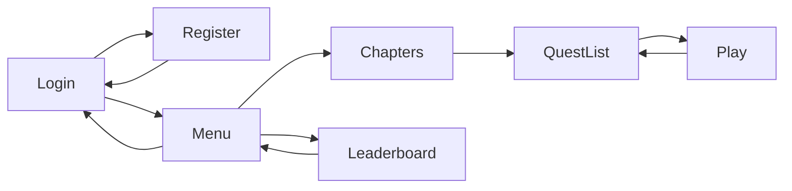
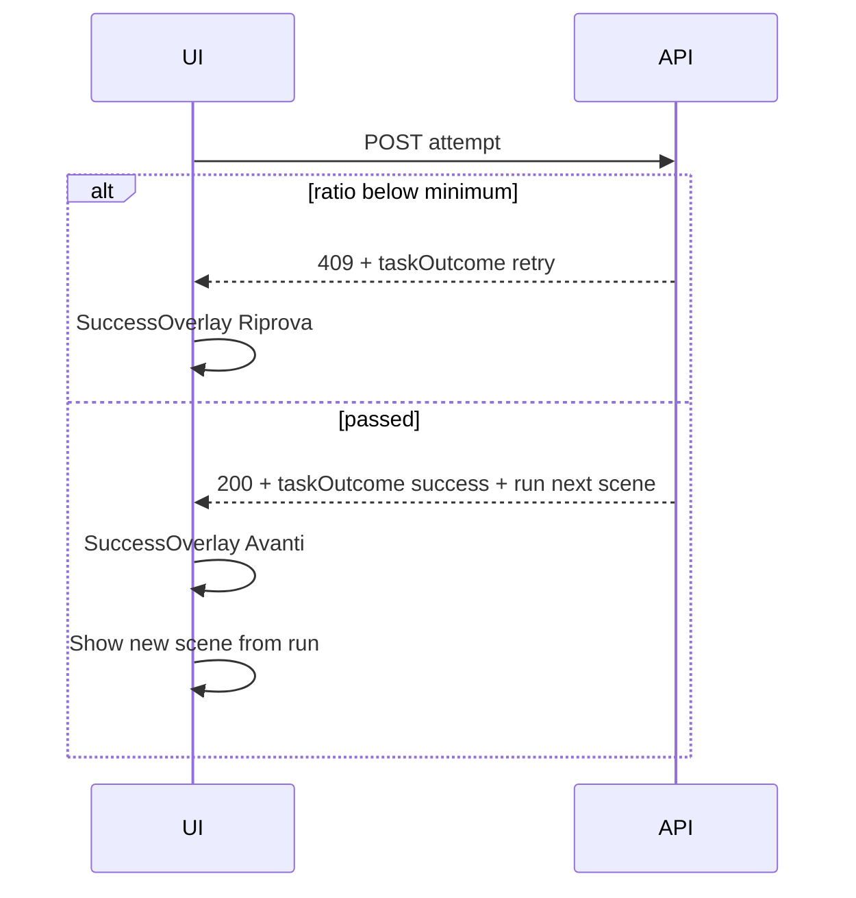

# Web game UI architecture (high level)

**Status:** v1 — **shell shipped** (2026-06-02). **Six task types** implemented (multiple choice, matching, drag_drop, free_text, error_spotting, cloze). Product decisions **§10** locked. Routes under `app/(auth)/` and `app/(game)/`; shadcn primitives in `components/ui/`; unknown `screen_type` values still use `TaskPlaceholder`.

**Purpose:** Structure the React + shadcn UI for the browser game: directory layout, screen map, shared quest chrome, data flow with existing `/api/*` + Supabase, styling via `app/globals.css`, and Italian player copy.

**Related docs:** `AGENTS.md` (state, errors, API), `.cursor/skills/product/SKILL.md` (learner UX), `.cursor/skills/web-task-type-ui/SKILL.md` (how to add each task type), `docs/quest-scene-content-format.md` (content JSON), `docs/web-stack-setup-plan.md` (Tailwind v4 + shadcn init — done).

---

## 1. Principles

| Principle | Implication |
| --------- | ----------- |
| **Server-authoritative** | Wallet, run position, scoring, unlocks come from `lib/game/services/*` via `/api/*`. UI never invents rewards or scene order. |
| **Thin routes, thick `lib/`** | Pages call a small `lib/api-client.ts` (to add); no duplicate Zod authority on the client. |
| **No global game store** | After mutations, refetch bootstrap / run snapshot (or `router.refresh()` on Server Component pages). Session token only in a narrow context + `sessionStorage`. |
| **Italian chrome** | Buttons, menus, overlays: Italian. Code and this doc: English. |
| **Image-driven** | Backgrounds from content asset keys (`background` on scenes; static keys for hub screens). Resolve URLs in one helper (`lib/game/content/asset-url.ts` or similar — TBD). |
| **KISS layout** | One quest **shell** component tree; screens differ by `scene_type` + `screen_type`, not by copy-pasted chrome. |
| **Design tokens in CSS** | Spacing, radii, panel transparency, and game-specific colours live in `app/globals.css` (`@theme` / `@layer components`), not scattered magic numbers in feature files. |

---

## 2. What already exists (reuse, don’t reinvent)

### Backend & content

- **Content catalog:** `lib/content/chapters/**` loaded by `lib/game/content/catalog-loader.ts`; validated with `contentCatalogSchema`.
- **Game APIs (session required):**

  | Method | Path | Role |
  | ------ | ---- | ---- |
  | GET | `/api/game/bootstrap` | Wallet + chapter/quest list + **`completedQuestIds`** |
  | GET | `/api/game/leaderboard` | Overall + team rankings |
  | POST | `/api/game/runs/start` | Start/resume quest run |
  | GET | `/api/game/runs/snapshot` | Active run + current scene |
  | POST | `/api/game/runs/[runId]/advance` | Story scene → next |
  | POST | `/api/game/runs/[runId]/retreat` | Previous scene (`sceneId` = current); position only — no completion/wallet rollback |
  | POST | `/api/game/runs/[runId]/attempt` | Task attempt → score → advance if min ratio met |

- **Auth APIs:** login, register, logout, session, `GET /api/auth/suggest-username`.
- **Messages:** `lib/game/clientMessages.ts` — map API `error` / `code` to Italian display text.
- **Scoring:** `evaluateTaskAttempt`, pizza/backpack rules in service layer.
- **Post-Controlla copy + rewards DTO:** `lib/game/task-outcome-messages.ts` (`buildTaskOutcome` → `taskOutcome` on attempt responses).

### Frontend foundation

- Next.js 16 App Router, React 19, Tailwind v4, shadcn **init** (`components.json`, `lib/utils.ts`, `app/globals.css`).
- **`components/ui/`** — shadcn primitives (button, card, dialog, …); add more via `npx shadcn@latest add …`.

### Intentionally out of scope (initial UI work)

- **Per-task-type renderers** — Implemented under `components/game/tasks/types/` for multiple choice, matching, drag_drop, free_text, error_spotting, and cloze (see **§5b** + **web-task-type-ui** skill). Unsupported `screen_type` values use **`TaskPlaceholder`**.
- **Freitext / LLM** — implemented (`screen_type: "free_text"`, `components/game/tasks/types/free-text/`); Controlla blocks with loading copy while the server runs the judge.
- Unity-specific `SpecialScreen*` — not ported unless content uses them on web.
- **“First playable milestone”** end-to-end slice — planned separately later; this doc does not define that checklist.

---

## 3. Proposed directory structure

Keep **routes** in `app/` and **reusable UI** in `components/`. Game-specific logic stays in `lib/`.

```text
app/
├── layout.tsx                    # globals.css, optional <Toaster /> later
├── page.tsx                      # redirect: session → menu, else login
├── (auth)/
│   ├── login/page.tsx
│   └── register/page.tsx
├── (game)/
│   ├── layout.tsx                # optional: GameSessionProvider (client)
│   ├── menu/page.tsx             # main menu
│   ├── shop/page.tsx             # room shop shell (Negozio)
│   ├── leaderboard/page.tsx
│   ├── chapters/page.tsx         # chapter overview
│   ├── chapters/[chapterId]/
│   │   └── page.tsx              # quest overview
│   └── play/
│       └── page.tsx              # quest run shell (scene router)
│
components/
├── ui/                           # shadcn primitives (generated)
└── game/
    ├── layout/
    │   ├── GameBackground.tsx    # h-dvh bg image + fallback gradient
    │   ├── GameShellHeader.tsx   # hub title/back/actions; play task title slot
    │   ├── CenteredCard.tsx      # login/register/menu narrow column
    │   └── HubPage.tsx           # game-shell-inset + header + scrollable panel
    ├── shell/
    │   ├── QuestShell.tsx        # play layout: header (HUD, Documento, Pausa) + content panel
    │   ├── QuestHud.tsx          # pizza + backpack (hubs + task play)
    │   ├── StoryPanel.tsx        # semi-transparent text box variants
    │   ├── TaskChrome.tsx        # instructions + task container + Indietro / Controlla
    │   └── SceneRouter.tsx       # picks story vs task by run.currentScene
    ├── overlays/
    │   ├── PauseOverlay.tsx
    │   ├── SuccessOverlay.tsx    # post-Controlla feedback
    │   └── ReferenceDocumentOverlay.tsx
    ├── screens/                  # thin page-specific compositions
    │   ├── LoginForm.tsx
    │   ├── RegisterForm.tsx
    │   ├── MainMenuActions.tsx
    │   ├── LeaderboardView.tsx
    │   ├── ShopView.tsx
    │   ├── ChapterGrid.tsx
    │   └── QuestList.tsx
    └── tasks/
        ├── TaskPanel.tsx         # dispatches by screen_type
        ├── TaskBodyLayout.tsx    # shared prompt + fixed meta + scrollable exercise (all types)
        ├── TaskPlaceholder.tsx
        └── types/                # one folder per task type
            └── multiple-choice/  # reference implementation

lib/
├── api-client.ts                 # fetch + auth header + jsonOk/jsonError parse (to add)
├── game/
│   ├── session-context.tsx       # bearer token + account snapshot (client)
│   ├── unlock-display.ts         # pure helpers: locked chapter/quest from bootstrap (display only)
│   ├── quest-progress-id.ts      # chapterId:questId keys for completedQuestIds
│   ├── scene-display.ts          # readTaskSceneTitle, readTaskChromeInstructions, readTaskScenePrompt
│   └── content/
│       └── resolve-asset-url.ts  # background key → /public/content-assets/...
```

**Route group `(game)`** keeps auth pages free of session provider weight. **`/play`** accepts `chapterId`, `questId` (and optionally resumes via snapshot without query if active run exists).

---

## 4. Screen map (player journey)

High-level flow:



### 4.1 Auth & hub (centered narrow column)

Shared layout: **`CenteredCard`** on **`GameBackground`** (static asset per screen).

| Screen | Route (proposed) | Elements | Italian labels (draft) |
| ------ | ---------------- | -------- | ---------------------- |
| **Login** | `/login` | username, password, submit, link to register | Accedi, Nome utente, Password, Registrati |
| **Register** | `/register` | generated username (read-only), regenerate, password ×2, submit, link to login | Registrati, Genera nome, Password, Ripeti password, Hai già un account? Accedi |
| **Main menu** | `/menu` | play, shop, leaderboard, logout | **Gioca** → `/chapters` always; Negozio, Classifica, Esci |
| **Shop** | `/shop` | back, HUD (bootstrap), empty panel (room + catalog later) | Negozio, Indietro |
| **Leaderboard** | `/leaderboard` | refresh, tabs overall/teams, back | Aggiorna, Individuale, Squadre, Indietro |
| **Chapter overview** | `/chapters` | back, chapter grid, HUD optional | Capitoli, Indietro |
| **Quest overview** | `/chapters/[chapterId]` | back, quest list, HUD | Missioni, Indietro |

**Locked:** **Gioca** always opens the **chapter overview** (`/chapters`). No smart “Continua” / resume shortcut in v1.

### 4.2 Quest play (`/play`)

Single route hosts **all scenes** for the active run. Sub-views:

| Mode | `scene_type` | `screen_type` (examples) | Chrome |
| ---- | ------------ | ------------------------- | ------ |
| **Story** | `story` | `info` | Full background; **StoryPanel** (text bottom); **Pausa**; **Indietro** (if `canRetreat`) + **Avanti**; no HUD |
| **Task** | `task` | `cloze`, `multiple_choice`, … | HUD; optional **Documento**; instruction strip; **TaskPanel**; **Controlla**; then success overlay → **Avanti** |

**Backgrounds:** `currentScene.background` from run snapshot (dynamic). Hub screens use fixed keys from `lib/game/content/hub-background-keys.ts`.

### 4.3 Overlays (shadcn `Dialog` or `Sheet`)

| Overlay | Trigger | Content |
| ------- | ------- | ------- |
| **Pause** | Top-right | Resume; exit to quest list or main menu |
| **Success** | After **Controlla** (`POST …/attempt`) | Server `taskOutcome`: pizza slices + backpack pieces earned, Italian headline/body (success or retry) — see **§10.4** |
| **Reference document** | Button left of HUD | Scrollable `referenceDocument.body` from task content |

Italian (draft): **Continua a giocare**, **Torna alle missioni**, **Menu principale**, **Documento**, **Chiudi**, **Riprova** (retry overlay), **Avanti** (after success).

---

## 5. Shared quest shell (layout contract)

ASCII regions (all quest play modes):

```text
┌─────────────────────────────────────────────────────────────┐
│  [Documento?]                              [HUD]  [Pausa]   │  ← task only: documento + HUD
│                                                             │
│                     (background image)                      │
│                                                             │
│              ┌─ StoryPanel / TaskChrome ─┐                  │
│              │  instructions (task)      │                  │
│              │  TaskPanel or story text  │                  │
│              │  [Indietro?] [Avanti] or [Controlla]         │  ← story/task: retreat when canRetreat
│              └───────────────────────────┘                  │
└─────────────────────────────────────────────────────────────┘
```

| Zone | Story | Task |
| ---- | ----- | ---- |
| Top-right **Pausa** | yes | yes |
| **HUD** (pizza count, backpack %) | no | yes |
| **Documento** | no | if `referenceDocument` in content |
| Bottom navigation | **Indietro** (if `canRetreat`) + **Avanti** → `retreat` / `advance` | **Indietro** + **Controlla** → `retreat` / `attempt`; overlay **Avanti** after success |
| Center panel | `StoryPanel` (single layout) | `TaskChrome` wraps instructions + `TaskPanel`; task **title** in `GameShellHeader` (`readTaskSceneTitle`) |
| Hub lists | `ChapterGrid` / `QuestList` as **`<button>`** rows (keyboard + disabled when locked) | — |

**CSS:** `GameBackground` uses `h-dvh`; outer **`game-shell-inset`** (`--game-shell-padding`); inner panels use **`game-panel`** + **`game-panel-inset`** (`--game-panel-padding`). Define translucent panel look once in `globals.css` (`--game-panel-bg`, spacing tokens).

### 5b. Task body layout (all task types)

Every task scene uses the same **copy + scroll contract**. Implement new types inside this frame; do not fork a second instruction strip or prompt box.

| Region | Source (JSON) | Component | Style | Scroll |
| ------ | ------------- | --------- | ----- | ------ |
| Play header title | `content.title` | `GameShellHeader` | Hub title styles; **single line + ellipsis** | — |
| Instruction | `content.instruction` | `TaskChrome` | `TASK_PLAY_INSTRUCTION_TEXT` (**semibold**) | No (fixed) |
| Prompt | `content.task.prompt` or per-item field (e.g. MC `questions[i].prompt`) | `TaskBodyLayout` | `TASK_PLAY_PROMPT_TEXT` (normal) | No (fixed) |
| Meta | — (validation, progress, hints) | `TaskBodyLayout` `beforeScroll` | `TASK_PLAY_META_TEXT` | No |
| Exercise | Type-specific widgets | `TaskBodyLayout` children | `TASK_PLAY_BODY_TEXT` (e.g. option labels) | **Yes** (overflow only here) |
| Actions | — | `TaskChrome` footer | **Indietro** + **Controlla** / **Avanti** | No (fixed) |

```text
TaskChrome
├── instruction (scene)
├── TaskBodyLayout
│   ├── prompt (task / per question)
│   ├── beforeScroll (errors, "Domanda 1 di N", …)
│   └── [scroll] exercise UI
└── footer: Indietro | Controlla / Avanti
```

**Helpers:** `lib/game/scene-display.ts` (`readTaskSceneTitle`, `readTaskSceneInstruction`, `readTaskChromeInstructions`, `readTaskScenePrompt`).

**Adding a task type:** Follow **`.cursor/skills/web-task-type-ui/SKILL.md`** (methodology: understand → clarify → code; phases: schema/catalog → UI → play submit → docs/tests). **Reference:** `components/game/tasks/types/multiple-choice/` + `lib/game/tasks/multiple-choice/`. Content contracts: `docs/quest-scene-content-format.md` (§5.2 + task-specific subsections).

**Multi-step tasks (e.g. MC `questions[]`):** Reuse shell **Avanti** / **Indietro** for item navigation (`SceneRouter` + `lib/game/tasks/multiple-choice/mc-question-nav.ts` as pattern); validate all items on final **Controlla**.

---

## 6. Data & state flow

### Reads

| UI need | Source |
| ------- | ------ |
| Logged-in user | `GET /api/auth/session` |
| Chapters, quests, wallet, **which quests are done** | `GET /api/game/bootstrap` (`completedQuestIds`) |
| Leaderboard | `GET /api/game/leaderboard` |
| Active scene | `GET /api/game/runs/snapshot` or response from start |

Prefer **Server Components** for hub pages that only display server-fetched props; pass `initialData` into small client widgets where needed (e.g. leaderboard refresh).

### Writes

| Player action | API |
| ------------- | --- |
| Login / register / logout | `/api/auth/*` |
| Start quest | `POST /api/game/runs/start` `{ chapterId, questId }` |
| Story next | `POST .../advance` `{ sceneId }` |
| Go back one scene | `POST .../retreat` `{ sceneId }` (current scene id); server moves run pointer only |
| Task check | `POST .../attempt` `{ sceneId, attemptPayload }` |

### Client-local state (only)

- Form fields before submit (login, register, task draft).
- Overlay open/close (`pauseOpen`, `documentOpen`, `successPayload`).
- **Not** stored: total slices, current scene id, unlock flags (refresh from server).

### Session

- Bearer token in `sessionStorage`; `GameSessionProvider` exposes `token`, `account`, `setSession`, `clearSession`.
- Middleware/layout: unauthenticated users → `/login`; 401 from API → clear session + redirect.

### Unlock display (locked — Option A)

`GET /api/game/bootstrap` returns **`completedQuestIds: string[]`** — each value is **`chapterId:questId`** (`lib/game/quest-progress-id.ts`), built from completed `player_quest_runs` rows. Quest folder names (`quest-01`, …) repeat in every chapter, so **never** compare bare `quest.id` to this list.

The UI derives lock state **for display only**:

1. **Quest locked** if `requiresQuestId` is set and **`chapterId:requiresQuestId`** is **not** in `completedQuestIds`.
2. **Chapter locked** if the previous chapter’s **main** quests are not all complete (qualified ids for that chapter).

Helper: `lib/game/unlock-display.ts` (pure functions, no extra API). **`POST /api/game/runs/start`** enforces the same rules server-side.

---

## 7. Error & feedback (from `AGENTS.md`)

| Situation | UX |
| --------- | -- |
| Wrong password, validation | **Inline** under fields |
| Task below min pizza ratio | **`SuccessOverlay`** in **retry** mode (`taskOutcome.kind === "retry"`) — not toast |
| `task_min_ratio_not_met` | HTTP 409 + `taskOutcome` in body; stay on scene; keep draft; **Riprova** closes overlay |
| Task passed | **`SuccessOverlay`** in **success** mode; show `awardedSlices` + `awardedBackpackPieces`; then **Avanti** uses `run` from same response (already on next scene) |
| Bootstrap / snapshot / catalog failure | **Sonner toast** (after `shadcn add sonner`) |
| Session expired mid-quest | Toast + redirect login |
| `active_run_exists` | Inline panel on `/play` with **Riprendi missione** (no toast — avoids duplicate copy) |

Centralize mapping in `lib/game/toast-from-api.ts` (thin wrapper over `clientMessages` + `code`).

---

## 8. shadcn components (planned)

Install incrementally when building each area (`npx shadcn@latest add <name>`).

### Core (first wave)

| Component | Use |
| --------- | --- |
| **button** | All primaries/secondaries |
| **input** | Login, register, task inputs |
| **label** | Form accessibility |
| **card** | Centered auth/menu column optional wrapper |
| **dialog** | Pause, success, reference document overlays |
| **tabs** | Leaderboard Individual / Squadre |
| **scroll-area** | Reference document long text |
| **separator** | Leaderboard sections (optional) |

### Second wave

| Component | Use |
| --------- | --- |
| **sonner** | Serious blocking errors only |
| **alert** | Inline quest banner (catalog down) |
| **badge** | Locked quest/chapter, team colour hint |
| **progress** | Backpack % visual (optional; numeric may suffice) |
| **skeleton** | Bootstrap / snapshot loading |
| **aspect-ratio** | Background image containers |

### Probably not needed early

- **sidebar**, **navigation-menu**, **command**, **data-table** — game is not a dashboard.
- **form** (react-hook-form) — optional; simple forms may use native submit + server errors first.

**Icons:** `lucide-react` (already in shadcn stack) for pause, document, pizza/backpack metaphors until sprite buttons land.

---

## 9. Styling (`app/globals.css`)

Extend existing shadcn tokens with **game layer** (names illustrative):

```css
@theme inline {
  /* --game-spacing-xs … --game-spacing-xl */
  /* --game-panel-bg: oklch(1 0 0 / 0.85); */
  /* --game-max-content-width: 28rem;  centered auth/menu */
  /* --game-shell-padding: 1rem; */
}

@layer components {
  .game-centered-column { … }
  .game-panel { … }
  .game-shell-top-bar { … }
  .game-shell-bottom-nav { … }
}
```

**Rules:**

- Hub screens: `max-width` + horizontal center (user request: slim, not full viewport width).
- Quest shell: full viewport; panels use shared `.game-panel`.
- Team colours (leaderboard): `--team-blue`, `--team-red` in `@theme` — do not hardcode in components.

**Background component:** `GameBackground` (client) preloads assets, crossfades between layers on key change, and uses `object-cover` full-viewport images with CSS gradient fallback. Auth hosts one shared instance in `app/(auth)/layout.tsx`; play uses `QuestShell` + optional `run.nextSceneBackground` preload.

---

## 10. Locked product decisions

### 10.1 Bootstrap completions (Option A — locked)

- **Decision:** One bootstrap call carries catalog **and** `completedQuestIds`.
- **Already in backend:** `bootstrapGameState` returns `completedQuestIds`; chapter/quest pages use it for lock badges and disabled taps.
- **UI rule:** Never guess completion in `localStorage`; refetch bootstrap after finishing a quest (return from `/play`).

### 10.2 Main menu — Gioca (Option A — locked)

- **Decision:** **Gioca** always navigates to **`/chapters`**.
- **Out of scope v1:** “Continua” into active run, last quest, or first incomplete quest.

### 10.3 Story navigation — keep it simple (locked)

- **Decision:** Story scenes have **no «Indietro»** (no previous scene) in v1.
- **Only «Avanti»** calls `POST …/advance` and moves the run forward on the server.
- **Why:** Going back would need a new API or risks UI/server mismatch. Re-reading is still possible by staying on the same scene until the player taps **Avanti**.
- **Hub screens** (menu, chapters, quest list, shop, leaderboard) keep **Indietro** for normal page back navigation.

### 10.4 Task success / retry overlay (locked)

**Trigger:** Player taps **Controlla** → `POST /api/game/runs/[runId]/attempt` with `sceneId` + `attempt` payload.

**Server** evaluates answers, computes `ratio`, applies `scoring` from the scene JSON, and builds **`taskOutcome`** via `lib/game/task-outcome-messages.ts` (Italian headline + body; pizza/backpack counts). The UI **does not** calculate rewards.

| Outcome | HTTP | Player stays on scene? | Overlay |
| ------- | ---- | ---------------------- | ------- |
| Not enough correct for pizza minimum | 409 `task_min_ratio_not_met` | yes | **retry** — `awardedSlices: 0`, `awardedBackpackPieces: 0` |
| Passed | 200 | no (run already advanced) | **success** — shows slices + backpack pieces earned this step |

**`taskOutcome` shape (display contract):**

```ts
{
  kind: "success" | "retry";
  ratio: number;                    // 0–1, for optional “X% corretto” line
  awardedSlices: number;
  awardedBackpackPieces: number;
  headline: string;                 // e.g. "Bravissimo!" / "Quasi!"
  body: string;                     // e.g. "Guadagni 2 fette di pizza e 1 pezzo nello zaino."
}
```

**Overlay UI (minimal):**

- Large **headline** + **body** from `taskOutcome`.
- Reward row: **🍕 +N** (fette di pizza), **🎒 +N** (pezzi nello zaino) — hide a row when zero.
- Optional secondary line: percent correct from `ratio` on retry.
- **success:** primary button **Avanti** → close overlay; render `run` from the same response (next scene).
- **retry:** primary **Riprova** → close overlay; keep task draft.
- **Mostra soluzione** (secondary, when `taskReview` is present and `screen_type` is not `free_text`): closes the overlay and enables in-task review (`reviewMode` on `TaskPanel`). The task footer primary becomes **Avanti** / **Riprova** (or quest-complete labels) and continues the same flow as the overlay primary. **Multi-question MC:** review starts at question 1; **Avanti** / **Indietro** walk questions with per-question solution highlights until the last question, where **Avanti** / **Riprova** advances the run.
- **`free_text`:** LLM **Valutazione** (summary on success, dimension scores + feedback) renders inside the overlay (`FreetextReviewOverlaySection`) — no **Mostra soluzione** button.

**`taskReview` (attempt-only contract):** Built server-side in `completeTaskScene` from unsanitized catalog task + attempt payload. Returned on **200** and **409** (`details.taskReview`). Never included in run snapshots (`sanitize-task-payload-for-client` unchanged). Shape: discriminated union by `screenType` in `lib/game/task-review.ts` (MC, matching, drag_drop, error_spotting, cloze, free_text).

**Visible scene while overlay is open:** The attempt response may already advance `run.currentScene` on the server. `/play` keeps the **completed** scene visible until dismiss:

| Hold | State | Purpose |
| ---- | ----- | ------- |
| Background | `backgroundHoldKey` | Crossfade stays on completed scene art (not next scene’s `background`). |
| Chrome | `chromeHoldScene` → `displayScene` | Header title, `TaskPanel`, documento, MC question index match the **submitted** scene — not the next task behind the dialog. |
| Drafts | `pendingDraftSyncSceneRef` | Defer `syncTaskDraftsForScene` until overlay closes so the player does not see empty inputs for the next scene. |

Apply the same chrome + background hold when **quest complete** opens the overlay (`onAdvanceStory`). **Retry (409):** no draft sync — answers stay on screen.

Implementation: `app/(game)/play/page.tsx` (`dismissSuccessOverlay` flushes pending draft sync). Reuse this pattern for any overlay shown while the server has already advanced the run.

**Copy changes:** Edit `task-outcome-messages.ts` only (not scattered strings in components). Current examples:

| kind | headline (examples) | body (intent) |
| ---- | ------------------- | ------------- |
| success | Perfetto! / Bravissimo! / Ottimo lavoro! | Praise + how many pizza slices and backpack pieces earned |
| retry | Quasi! | Correct % shown + encourage another try (no rewards) |

**Flow (mermaid):**



### 10.5 Visual assets — none committed yet (locked)

- **Decision:** No raster backgrounds or sprites in `public/content-assets/` yet. UI must still ship layout and flow.
- **v1 approach (keep simple):**
  - **`GameBackground`:** if resolved URL missing or image 404 → fallback to a **CSS gradient or solid** using tokens (e.g. `--game-hub-bg`, `--game-play-bg`) in `globals.css`. No broken-image icons.
  - **Chapter/quest tiles:** neutral **card** placeholders (title + lock badge) until art exists.
  - **Content `background` keys** from JSON stay wired through one resolver so dropping real files in later does not require route changes.
- **Later:** When art lands, only resolver + files change; not per-screen hacks.

### 10.6 Session storage only (locked)

- **Decision:** Bearer token in **`sessionStorage`** only (no httpOnly cookies in v1).
- **Pattern:** Narrow `GameSessionProvider` (client): `token`, `account` from `GET /api/auth/session`, `setSession` on login/register, `clearSession` on logout / 401.
- **Gate:** Layout or middleware redirects unauthenticated users to `/login`; game routes attach `Authorization: Bearer …` via `lib/api-client.ts`.
- **Out of scope v1:** Cookie-based session, refresh tokens, “remember me”.

### 10.7 Task types and Freitext

- **Shell (done):** Quest play, Controlla, success/retry overlay, documento, pause, shared **TaskChrome** + **TaskBodyLayout** (§5b).
- **Per-type UI:** Roll out one `screen_type` at a time using **`.cursor/skills/web-task-type-ui/SKILL.md`**. **Multiple choice** is the reference implementation (2026-06-03).
- **Placeholder:** Unsupported `screen_type`s still render `TaskPlaceholder` inside `TaskBodyLayout` (optional flat `task.prompt`).
- **Server:** Unsupported **scored** types may return `task_eval_not_implemented` — inline Italian from `clientMessages`, not a toast.
- **Freitext / LLM:** `FreeTextTask` + play-page draft; attempt POST runs `evaluateFreitextLlmScene` server-side; retry overlay shows LLM `summaryFeedback` (success overlay stays generic).

---

## 10b. Still open (later iteration)

1. **Asset pipeline:** Final URL pattern and naming under `public/content-assets/` when art exists (see `public/content-assets/README.md`).
2. **End-to-end “playable milestone” checklist** — separate implementation plan / todo list (not defined here).
3. **Server-side quest lock enforcement** on `runs/start` (UI display locks are enough for v1).

---

## 11. Implementation phases (high level)

| Phase | Deliverable |
| ----- | ----------- |
| **P0** | shadcn: button, input, label, card, dialog, tabs, scroll-area; game tokens in `globals.css`; `lib/api-client.ts` + session provider |
| **P1** | Auth screens (login/register) + session gate |
| **P2** | Main menu, shop shell, leaderboard, static backgrounds |
| **P3** | Chapter + quest overview; bootstrap-driven grid/list; HUD on hubs |
| **P4** | `/play` shell: snapshot, start run, story scenes + advance |
| **P5** | Task shell: Controlla → attempt, `SuccessOverlay` from `taskOutcome`, documento; `TaskPlaceholder` |
| **P6** | Pause overlay + exit paths; Sonner for fatal errors |
| **P7** | Multiple choice (`TaskBodyLayout` + MC renderer) — **done** |
| **P7+** | Remaining types under `components/game/tasks/types/*` via **web-task-type-ui** skill (matching, drag_drop, **free_text** done; cloze, error_spotting, …) |

Each phase: Italian copy, one layout primitive reused, no new global stores. Phases are **technical building blocks**, not the deferred “playable milestone” checklist.

---

## 12. Italian copy cheat sheet (chrome)

| English (internal) | Italian (UI) |
| ------------------ | ------------ |
| Login | Accedi |
| Register | Registrati |
| Logout | Esci |
| Play | Gioca |
| Shop | Negozio |
| Leaderboard | Classifica |
| Refresh | Aggiorna |
| Individual / Team | Individuale / Squadre |
| Back | Indietro |
| Next | Avanti |
| Check (task) | Controlla |
| Pause | Pausa |
| Resume | Continua a giocare |
| Reference doc | Documento |
| Close | Chiudi |
| Try again (overlay) | Riprova |
| Success overlay CTA | Avanti |

Task reward / retry phrases (`Perfetto!`, `Quasi!`, …) live in **`lib/game/task-outcome-messages.ts`**, not in overlay components.

Content strings (`content.text`, task prompts) come from JSON — already Italian in samples.

---

## 13. Background strategy (static vs dynamic)

| Screen | Background source |
| ------ | ------------------- |
| Login, Register | Shared `GameBackground` in `app/(auth)/layout.tsx`; key from `authBackgroundKeyForPath()`; both auth PNGs preloaded via `authBackgroundPreloadKeys` |
| Main menu, chapters, shop, leaderboard | Shared `HubBackgroundHost` in `app/(game)/layout.tsx` via `useRegisterHubBackground` on each page/`HubPage` |
| Chapter overview | Pass `backgroundKey` / `preloadAssetKeys` to `HubPage` when art exists |
| Quest overview | Dynamic key from catalog/quest when available; fallback gradient |
| Story / Task scenes | `run.currentScene.background` from snapshot; `run.nextSceneBackground` preloads the next catalog scene |

Single resolver (`resolveAssetUrl`) + preload helper (`preloadAssetUrl`). See `docs/background-transitions-qa.md` for manual QA.

**Until assets exist:** Do not block UI on missing images; hubs and play should look intentional with tokens only. Auth login/register PNGs live under `public/content-assets/hubs/auth/` (see `public/content-assets/README.md`).

---

*Changelog:* 2026-06-03 — §5b task body layout + **web-task-type-ui** skill link; MC marked shipped; §10.7 / P7 updated.

*Next step:* Implement next `screen_type` using **`.cursor/skills/web-task-type-ui/SKILL.md`**. **§10** product/tech choices are locked; playable milestone checklist is **not** in this file.
